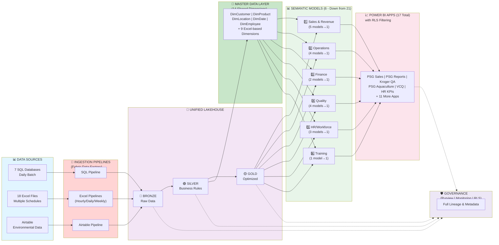

# PSG Future State Data Architecture - Presentation Ready (Compact)
## Consolidated 21 Models → 6 | Unified Lakehouse Platform

---



---

## CONSOLIDATION AT A GLANCE

| Element | Current State | Future State | Benefit |
|---------|---------------|--------------|---------|
| **Semantic Models** | 21 (scattered, redundant) | 6 (consolidated, governed) | 71% reduction |
| **Data Storage** | 3 systems (duplicated) | 1 unified Lakehouse | Single source of truth |
| **Excel Integration** | Direct to Power BI | Lakehouse + Governance | Full audit trail |
| **Shared Dimensions** | Duplicated per model | 14 shared MDM layer | No data inconsistency |
| **Row-Level Security** | Separate models | RLS on unified models | Eliminates redundancy |

---

## SIX CONSOLIDATED SEMANTIC MODELS

### 1️⃣ **Sales & Revenue** 
Consolidates 5 models → AS400 + SAP + Excel Sales Data
- **Apps**: PSG Sales, Kroger QA, Inventory Reports
- **RLS**: Kroger | Amazon filtering

### 2️⃣ **Operations**
Consolidates 4 models → Production tracking + Inventory
- **Apps**: Aquaculture, Steelhead, Production Tracker
- **RLS**: Amazon-only inventory rows

### 3️⃣ **Finance & Budgeting**
Consolidates 2 models → GL + AP/AR + Budget data
- **Apps**: Team PSG, Buyer Metrics
- **RLS**: None (Finance sees all)

### 4️⃣ **Quality & Compliance**
Consolidates 4 models → VCQ + EHS + Airtable
- **Apps**: VCQ, Shellfish compliance reports
- **RLS**: None (Compliance sees all)

### 5️⃣ **HR & Workforce**
Consolidates 3 models → Payroll + WFM + Staffing
- **Apps**: HR KPIs, Shellfish Piece Rate
- **RLS**: None (HR sees all)

### 6️⃣ **Training & Development**
Consolidates 1 model → Course + STAR 360 + Certifications
- **Apps**: T&D KPIs
- **RLS**: None

---

## DATA FLOW: SOURCES → LAKEHOUSE → MODELS → APPS

```
SQL Server (7 DBs)    Excel (18 Files)    Airtable
        │                    │                │
        └────────┬───────────┴────────┬───────┘
                 │                    │
            Fabric Pipelines    Scheduled Ingestion
                 │                    │
        ┌────────┴────────────────────┴────────┐
        ▼                                       ▼
    BRONZE ZONE (Raw)  ◄─────┐
           │                  │ Zero Transformation
           ▼                  │
    SILVER ZONE (Cleaned) ◄───┘
           │
           ├──► 14 Shared Dimensions (MDM)
           │
           ▼
    GOLD ZONE (Optimized)
           │
           ├──► 6 Semantic Models
           │
           ▼
    Power BI Apps (17 total with RLS)
```

---

## DATA SOURCES SUMMARY

### **SQL Server (7 Databases - Daily)**
- AS400 (Sales, Customers, GL)
- SAP (Materials, Inventory, Products)  
- Mercatus (Feed, Production)
- Army CoE (Environmental)
- GoFormz (Mobile Forms)
- EHS Forms (Compliance)
- HR/Payroll/WFM (Workforce)

### **Excel (18 Files - Multiple Schedules)**
- **Hourly (2)**: Kroger IWI, Amazon Inventory
- **Daily (7)**: Shellfish Flow, Profitability, VCQ, Vena Budget
- **Twice Daily (8)**: Kroger files, Budgets, Forecasts
- **Weekly (1)**: Farm Summary

### **Airtable (1 Source)**
- Environmental Compliance (Permits, Violations, Enforcement)

---

## BENEFITS & SUCCESS METRICS

✅ **Consolidation**
- 71% model reduction (21→6)
- Unified Lakehouse (single source of truth)
- 14 shared dimensions (no duplication)

✅ **Performance**
- Query response: <5 seconds
- Hourly refresh: <60 min end-to-end
- Daily refresh: <2 hours end-to-end

✅ **Governance**
- 100% lineage tracking (Purview)
- Full metadata & data quality controls
- Complete audit trail from source to consumption

✅ **User Experience**
- All 17 Power BI apps unified
- Consistent data definitions
- RLS-based multi-tenant access

---

## 4-PHASE IMPLEMENTATION (16 Weeks)

| Phase | Focus | Timeline | Outcome |
|-------|-------|----------|---------|
| **1** | Lakehouse foundation + SQL ingestion | Weeks 1-4 | Bronze zone operational |
| **2** | Excel & Airtable integration | Weeks 5-8 | All 18 Excel files + dimensions |
| **3** | Model consolidation & migration | Weeks 9-12 | 6 models ready, RLS tested |
| **4** | Optimization & cutover | Weeks 13-16 | All apps live, training complete |

---

## NEXT STEPS

1. ✅ **Approve** this architecture
2. ✅ **Confirm** 6-model consolidation strategy
3. ✅ **Assign** data owners (1 per model)
4. ✅ **Validate** refresh SLAs with stakeholders
5. ✅ **Kick off** Phase 1 implementation
