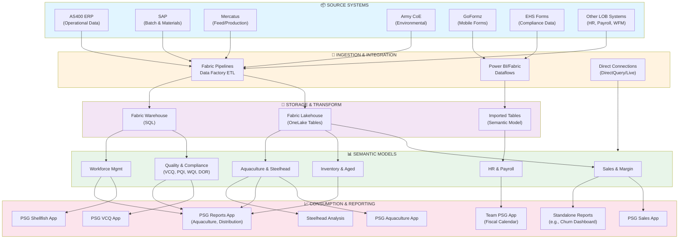

# PSG Data Architecture Flowchart - Enhanced Lineage

## Legend
- **Solid Lines**: Direct data flow/lineage from source to consumption
- **Color Coding**:
  - 🔵 Blue: Source Systems
  - 🟠 Orange: Ingestion & Integration
  - 🟣 Purple: Storage & Transform
  - 🟢 Green: Semantic Models
  - 🔴 Pink: Consumption & Reporting

## Data Lineage Notes
- **Direct Query/Live Connections**: Bypass storage layers, connect directly to models
- **Lakehouse**: Serves Sales, Inventory, and Aquaculture models
- **Warehouse (SQL)**: Serves Quality/Compliance and Workforce Management models
- **Imported Tables**: Serves HR & Payroll models

## Next Steps for Architecture Review
- [ ] Identify data quality checkpoints needed between layers
- [ ] Map freshness/SLA requirements per app
- [ ] Document cross-model data dependencies
- [ ] Identify consolidation opportunities among semantic models
- [ ] Plan "future state" architecture improvements
