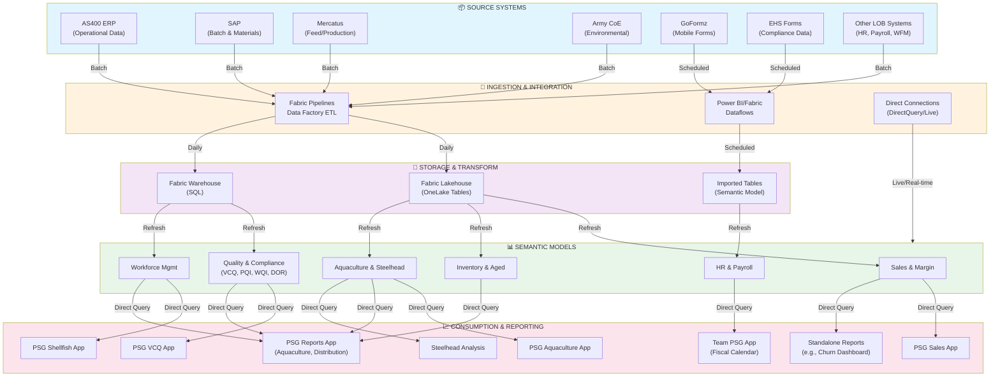

# PSG Data Architecture Flowchart - Enhanced Lineage with Data Flow Types

## Legend

### Data Flow Types
- 🔵 **Batch**: Scheduled data transfer at set intervals (typically nightly)
- 🟡 **Scheduled**: Regular dataflow runs on a defined schedule
- 🟢 **Daily**: Data refreshes once per day
- 🟣 **Refresh**: Semantic model refresh cycle
- 🔴 **Direct Query**: Real-time query against source data (no caching)
- ⚪ **Live/Real-time**: Continuous or near-real-time data flow

### Color Coding by Layer
- 🔵 Blue: Source Systems
- 🟠 Orange: Ingestion & Integration
- 🟣 Purple: Storage & Transform
- 🟢 Green: Semantic Models
- 🔴 Pink: Consumption & Reporting

## Data Lineage & Flow Characteristics
- **Source → Ingestion**: Mostly batch/scheduled processes moving data from operational systems
- **Ingestion → Storage**: Batch daily loads to Lakehouse and Warehouse; scheduled dataflows to Imported Tables
- **Storage → Models**: Semantic models refresh from underlying storage layers
- **Models → Consumption**: Direct Query connections provide real-time/fresh data to reporting apps
- **Direct Query Path**: DirectConnect bypasses storage layers for real-time data access directly to models

## Key Observations
- **Real-time Reporting**: Apps use Direct Query connections for fresh data
- **Batch Processing**: Most source data flows through daily batch pipelines
- **Storage Consolidation**: Data distributed across 3 storage types (Lakehouse, Warehouse, Imported Tables)
- **Critical Dependencies**: AquacultureModel and PSGReports serve as central hubs feeding multiple downstream apps

## Next Steps for Architecture Review
- [ ] Identify data quality checkpoints needed between layers
- [ ] Map freshness/SLA requirements per app (confirm refresh frequencies align with business needs)
- [ ] Document cross-model data dependencies
- [ ] Identify consolidation opportunities among semantic models
- [ ] Plan "future state" architecture improvements
