```mermaid
flowchart TD
    subgraph SqlSources["📊 SQL SERVER SOURCES<br/>(Pre-Validated)"]
        AS400["AS400 ERP<br/>(Operational Data)"]
        SAP["SAP<br/>(Batch & Materials)"]
        Mercatus["Mercatus<br/>(Feed/Production)"]
        ArmyCoE["Army CoE<br/>(Environmental)"]
        GoFormz["GoFormz<br/>(Mobile Forms)"]
        EHSForms["EHS Forms<br/>(Compliance Data)"]
        OtherSources["Other LOB Systems<br/>(HR, Payroll, WFM)"]
    end

    subgraph ExcelSources["📋 EXCEL/AIRTABLE SOURCES<br/>(SharePoint)"]
        ExcelHourly["Hourly Refresh<br/>• Kroger IWI Inventory & Projections<br/>• Amazon Inventory Tracker<br/>(Multi-tab: Fact + Dimension)"]
        ExcelDaily["Daily Refresh<br/>• Shellfish Flow Sheet<br/>• Steelhead Product Profitability<br/>• Oyster Count by SKU<br/>• Penn Cove Product Profitability<br/>• South Bend Product Profitability<br/>• VCQ Complaint Log"]
        ExcelOnDemand["Twice Daily + Manual Trigger<br/>• Kroger Category Map<br/>• Kroger Calendar<br/>• Kroger Allocations<br/>• Spat Sampling Master File<br/>• BenchmarkMapping<br/>• Shellfish Budget<br/>• Shellfish Projections"]
        ExcelWeekly["Weekly - Monday Morning<br/>• Farm Summary FY26"]
    end

    subgraph Ingestion["🔄 UNIFIED INGESTION LAYER<br/>(Fabric Data Factory Pipelines)"]
        PipelineSql["SQL Pipeline<br/>Copy Activity<br/>Daily Batch"]
        PipelineExcelHourly["Excel Pipeline<br/>Copy Activity<br/>Hourly Refresh"]
        PipelineExcelDaily["Excel Pipeline<br/>Copy Activity<br/>Daily Refresh"]
        PipelineExcelOnDemand["Excel Pipeline<br/>Copy Activity<br/>Twice Daily + Manual"]
        PipelineExcelWeekly["Excel Pipeline<br/>Copy Activity<br/>Weekly - Mon 6AM"]
        ValidationCheck["✅ Data Pre-Validated<br/>at Source"]
    end

    subgraph Lakehouse["💾 UNIFIED LAKEHOUSE<br/>(OneLake - Single Source of Truth)"]
        Bronze["🔵 BRONZE ZONE<br/>(Raw Data)<br/>- SQL Server data (as-is)<br/>- Excel files (tab-separated Delta Tables)<br/>- Full audit trail<br/>- Zero transformation"]
        Silver["🟢 SILVER ZONE<br/>(Cleaned & Business-Ready)<br/>- Business rules applied<br/>- Referential integrity<br/>- Fact & Dimension separation<br/>- Excel facts + SQL facts unified<br/>- Ready for analytics"]
        Gold["🟡 GOLD ZONE<br/>(Aggregated & Optimized)<br/>- Pre-calculated metrics<br/>- Denormalized for performance<br/>- Report-ready fact tables<br/>- Optimized dimensions"]
    end

    subgraph MDM["🎯 MASTER DATA MANAGEMENT LAYER<br/>(Unified Dimensions - Silver/Gold Zone)"]
        DimCustomer["📋 DimCustomer<br/>(from AS400 SQL)<br/>- Single version of truth<br/>- Customer ID<br/>- Account hierarchy"]
        DimProduct["📋 DimProduct<br/>(from SAP SQL)<br/>- Product ID<br/>- Category<br/>- Cost structure<br/>- SKU mapping"]
        DimLocation["📋 DimLocation<br/>(from AS400/SAP SQL)<br/>- Facility/Site<br/>- Region<br/>- Operational data"]
        DimDate["📋 DimDate<br/>(Calendar)<br/>- Fiscal calendar<br/>- Standard calendar<br/>- Holiday flags"]
        DimEmployee["📋 DimEmployee<br/>(from HR/Payroll SQL)<br/>- Employee ID<br/>- Department<br/>- Role"]
        ExcelDimensions["📋 Excel Dimensions<br/>(from Excel Bronze)<br/>- Kroger Category Map<br/>- Kroger Calendar<br/>- BenchmarkMapping<br/>- Steelhead Product Prof<br/>- Oyster Count by SKU<br/>- Penn Cove Product Prof<br/>- South Bend Product Prof<br/>- Kroger IWI Inventory (Dim)<br/>- Amazon Inventory (Dim)"]
    end

    subgraph Models["📊 CONSOLIDATED SEMANTIC MODELS<br/>(Future State - 4 Models)"]
        SalesModel["Sales & Revenue<br/>Facts: Transactions, Orders, Invoices<br/>Excel Facts: Kroger Allocations<br/>Dims: Customer, Product,<br/>Location, Date<br/>RLS: None required"]
        OpsModel["Operations<br/>Facts: Inventory, Production<br/>Excel Facts: Shellfish Flow,<br/>Farm Summary, Kroger IWI,<br/>Amazon Inventory<br/>Dims: Product, Location,<br/>Date, Facility<br/>RLS: Amazon data filtering"]
        QualityModel["Quality & Compliance<br/>Facts: QC Tests, Audit Results<br/>Excel Facts: VCQ Complaint Log,<br/>Spat Sampling<br/>Dims: Location, Date,<br/>Employee, Benchmark<br/>RLS: None required"]
        FinanceModel["Financial Analysis<br/>Facts: Budget, Projections,<br/>Profitability, Payroll<br/>Excel Facts: Shellfish Budget,<br/>Shellfish Projections,<br/>Steelhead Profitability,<br/>Penn Cove Profitability,<br/>South Bend Profitability<br/>Dims: Customer, Product,<br/>Location, Date, Employee<br/>RLS: None required"]
    end

    subgraph Consumption["📈 CONSUMPTION LAYER<br/>(Power BI Apps with RLS)"]
        PSGReports["PSG Reports App"]
        PSGSales["PSG Sales App"]
        PSGAquaculture["PSG Aquaculture App"]
        PSGVCQ["PSG VCQ App"]
        PSGShellfish["PSG Shellfish App"]
        SteelheadApp["Steelhead Analysis"]
        TeamPSG["Team PSG App"]
        StandaloneReports["Standalone Reports"]
        KrogerQA["Kroger QA App<br/>(RLS: Kroger data only)"]
        AmazonInventory["Amazon Inventory App<br/>(RLS: Amazon data only)"]
    end

    subgraph Governance["🛡️ GOVERNANCE & METADATA LAYER"]
        DataCatalog["Data Catalog<br/>(Purview Integration)<br/>- Data lineage<br/>- Data ownership<br/>- Sensitivity tags<br/>- Fact vs Dimension tracking"]
        MonitoringAlerts["Monitoring & Alerts<br/>- Pipeline health<br/>- Data freshness<br/>- Quality metrics<br/>- Refresh schedules"]
        RLSConfig["Row-Level Security<br/>Configuration<br/>- Amazon filtering<br/>- Kroger filtering<br/>- Other multi-tenant rules"]
    end

    %% SQL SOURCES TO INGESTION
    AS400 --> ValidationCheck
    SAP --> ValidationCheck
    Mercatus --> ValidationCheck
    ArmyCoE --> ValidationCheck
    GoFormz --> ValidationCheck
    EHSForms --> ValidationCheck
    OtherSources --> ValidationCheck

    ValidationCheck --> PipelineSql

    %% EXCEL SOURCES TO INGESTION
    ExcelHourly --> PipelineExcelHourly
    ExcelDaily --> PipelineExcelDaily
    ExcelOnDemand --> PipelineExcelOnDemand
    ExcelWeekly --> PipelineExcelWeekly

    %% INGESTION TO BRONZE
    PipelineSql -->|Daily Batch| Bronze
    PipelineExcelHourly -->|Hourly| Bronze
    PipelineExcelDaily -->|Daily| Bronze
    PipelineExcelOnDemand -->|Twice Daily + Manual| Bronze
    PipelineExcelWeekly -->|Monday 6AM| Bronze

    %% BRONZE TO SILVER
    Bronze -->|Deduplication<br/>Business Rules<br/>Cleaning<br/>Fact/Dimension Separation| Silver

    %% SILVER TO GOLD
    Silver -->|Aggregations<br/>Pre-calculations<br/>Denormalization| Gold

    %% SILVER/GOLD TO MDM DIMENSIONS
    Silver -->|Customer Data| DimCustomer
    Silver -->|Product Data| DimProduct
    Silver -->|Location Data| DimLocation
    Silver -->|Employee Data| DimEmployee
    Silver -->|Excel Dimension Tables| ExcelDimensions

    %% GOLD/DIMENSIONS TO MODELS
    Gold -->|Sales Facts| SalesModel
    DimCustomer --> SalesModel
    DimProduct --> SalesModel
    DimLocation --> SalesModel
    DimDate --> SalesModel

    Gold -->|Operations Facts<br/>Inventory, Flow, Farm| OpsModel
    DimProduct --> OpsModel
    DimLocation --> OpsModel
    DimDate --> OpsModel
    ExcelDimensions --> OpsModel

    Gold -->|Quality Facts<br/>VCQ, Compliance| QualityModel
    DimLocation --> QualityModel
    DimDate --> QualityModel
    DimEmployee --> QualityModel
    ExcelDimensions --> QualityModel

    Gold -->|Finance Facts<br/>Budget, Profitability| FinanceModel
    DimCustomer --> FinanceModel
    DimProduct --> FinanceModel
    DimLocation --> FinanceModel
    DimDate --> FinanceModel
    DimEmployee --> FinanceModel
    ExcelDimensions --> FinanceModel

    %% MODELS TO CONSUMPTION
    SalesModel -->|Direct Query| PSGSales
    SalesModel -->|Direct Query| PSGReports
    SalesModel -->|Direct Query| StandaloneReports

    OpsModel -->|Direct Query| PSGAquaculture
    OpsModel -->|Direct Query| PSGReports
    OpsModel -->|Direct Query| SteelheadApp
    OpsModel -->|Direct Query + RLS| AmazonInventory

    QualityModel -->|Direct Query| PSGVCQ
    QualityModel -->|Direct Query| PSGReports
    QualityModel -->|Direct Query| PSGShellfish

    FinanceModel -->|Direct Query| TeamPSG
    FinanceModel -->|Direct Query| PSGReports
    FinanceModel -->|Direct Query + RLS| KrogerQA

    %% GOVERNANCE CONNECTIONS
    Bronze -.->|Metadata| DataCatalog
    Silver -.->|Lineage| DataCatalog
    Gold -.->|Ownership| DataCatalog
    Models -.->|Business Rules| DataCatalog

    PipelineSql -.->|Health| MonitoringAlerts
    PipelineExcelHourly -.->|Health| MonitoringAlerts
    PipelineExcelDaily -.->|Health| MonitoringAlerts
    PipelineExcelOnDemand -.->|Health| MonitoringAlerts
    PipelineExcelWeekly -.->|Health| MonitoringAlerts

    OpsModel -.->|Configuration| RLSConfig
    FinanceModel -.->|Configuration| RLSConfig

    style SqlSources fill:#e1f5ff
    style ExcelSources fill:#fff3e0
    style Ingestion fill:#ffd4d4
    style Lakehouse fill:#f3e5f5
    style MDM fill:#c8e6c9
    style Models fill:#e8f5e9
    style Consumption fill:#fce4ec
    style Governance fill:#ede7f6
```

# PSG Future State Data Architecture - Comprehensive Fabric-Native Design with Excel Integration

## Executive Summary
This comprehensive future state architecture implements Microsoft Fabric best practices, consolidating all data sources (SQL Server + 16 Excel files) into a unified Lakehouse platform. It eliminates direct Power BI connections to Excel files, implements proper data governance, reduces redundancy through consolidated semantic models, and adds Row-Level Security (RLS) for multi-tenant data access control.

---



---

## DETAILED INGESTION STRATEGY

### **SQL Server Sources → Fabric Pipelines**

**All SQL sources consolidated through single ingestion path:**

| Source | Frequency | Data Type | Volume | Connection |
|--------|-----------|-----------|--------|-----------|
| AS400 ERP | Daily Batch | Operational (Sales, Customers) | Large | SQL Server |
| SAP | Daily Batch | Materials, Inventory, Products | Large | SQL Server |
| Mercatus | Daily Batch | Feed, Production | Medium | SQL Server |
| Army CoE | Daily Batch | Environmental Data | Small | SQL Server |
| GoFormz | Daily Batch | Mobile Forms | Small | SQL Server |
| EHS Forms | Daily Batch | Compliance Data | Small | SQL Server |
| HR/Payroll/WFM | Daily Batch | Employees, Compensation | Medium | SQL Server |

**Implementation:**
- Single Fabric Data Factory Pipeline with Copy Activity
- All sources load to Bronze zone daily
- Validation occurs BEFORE Lakehouse (at source)

---

### **Excel Files → Fabric Pipelines (5 Separate Schedules)**

#### **Schedule 1: Hourly Refresh (2 files)**
```
Source: SharePoint (Team National Sales Key Accounts)
Files: Kroger IWI Inventory & Projections, Amazon Inventory Tracker
Frequency: Every hour (24/7)
Special Handling: Multi-tab ingestion (each tab → separate Delta Table)
  - Kroger IWI: Inventory tab + Projections tab
  - Amazon: Inventory tab + Projections tab
Bronze Loading: 4 Delta Tables created
Fact/Dimension: Both (Fact tables + Dimension tables)
```

**Why Hourly?** — Critical for inventory management and key account monitoring

#### **Schedule 2: Daily Refresh (6 files)**
```
Source: SharePoint (multiple Team sites)
Files: 
  - Shellfish Flow Sheet (Team Pacific Shellfish General - Farms General)
  - Steelhead Product Profitability (Team Aquaculture-Aquaculture Accounting)
  - Oyster Count by SKU (Team Aquaculture-Aquaculture Accounting)
  - Penn Cove Product Profitability (Team Aquaculture-Aquaculture Accounting)
  - South Bend Product Profitability (Team Aquaculture-Aquaculture Accounting)
  - VCQ Complaint Log (VCQ)
Frequency: Daily (time TBD, but all at same time)
Bronze Loading: 6 Delta Tables created
Fact/Dimension: Mix of Facts (Flow Sheet, Budget, Projections, Complaint Log) 
               and Dimensions (Profitability data)
```

**Why Daily?** — Production, quality, and cost tracking for daily operations

#### **Schedule 3: Twice Daily + Manual Trigger (7 files)**
```
Source: SharePoint (Project Team Power BI + Team Pacific Shellfish)
Files:
  - Kroger Category Map (Dimension)
  - Kroger Calendar (Dimension)
  - Kroger Allocations (Fact)
  - Spat Sampling Master File (Fact)
  - BenchmarkMapping (Dimension)
  - Shellfish Budget (Fact)
  - Shellfish Projections (Fact)
Frequency: 
  - Automatic: 8:00 AM and 4:00 PM daily
  - Manual: Trigger on-demand when files updated
Bronze Loading: 7 Delta Tables created
Fact/Dimension: 4 Facts + 3 Dimensions
```

**Why Twice Daily + Manual?** — Budget and planning data needs flexibility; teams update throughout day

#### **Schedule 4: Weekly - Monday Morning (1 file)**
```
Source: SharePoint (Team Pacific Shellfish General - Farms General)
File: Farm Summary FY26
Frequency: Monday 6:00 AM (before workday)
Bronze Loading: 1 Delta Table created
Fact/Dimension: Fact table
```

**Why Weekly Monday?** — Farm summary is weekly report; Monday morning before team arrives

---

## EXCEL FILES INVENTORY WITH ANNOTATIONS

### **All 16 Excel Files with Designations:**

| File Name | Domain | Refresh | Size | Fact/Dim | SQL Join | Evaluation Flag | Semantic Model (Current) |
|-----------|--------|---------|------|----------|----------|------------------|--------------------------|
| Kroger Category Map | Sales/Key Accounts | On Demand | <1MB | Dimension | Yes | ✅ | SalesModel |
| Kroger Calendar | Sales/Key Accounts | On Demand | <1MB | Dimension | No | ✅ | Kroger QA Model |
| Kroger Allocations | Sales/Key Accounts | On Demand | <1MB | Fact | Yes | - | Kroger QA Model |
| Spat Sampling Master File | Shellfish Farms | On Demand | <1MB | Fact | Yes | - | Shellfish Model |
| BenchmarkMapping | EHS | On Demand | <1MB | Dimension | Yes | - | Benchmark Model |
| Shellfish Budget | Shellfish Sales | On Demand | <1MB | Fact | Yes | ⚠️ Evaluate if used | ShellfishItemHistory |
| Shellfish Projections | Shellfish Sales | On Demand | <1MB | Fact | Yes | ⚠️ Evaluate if used | ShellfishItemHistory |
| Shellfish Flow Sheet | Shellfish Farms/Hatchery | Daily | <1MB | Fact | Yes | - | Shellfish Model |
| Steelhead Product Profitability | Steelhead | Daily | <1MB | Dimension | Yes | - | SalesModel |
| Oyster Count by SKU | Shellfish Sales | Daily | <1MB | Dimension | Yes | - | ShellfishItemHistory |
| Penn Cove Product Profitability | Shellfish Sales | Daily | <1MB | Dimension | Yes | - | ShellfishItemHistory |
| South Bend Product Profitability | Shellfish Sales | Daily | <1MB | Dimension | Yes | - | ShellfishItemHistory |
| Kroger IWI Inventory & Projections | Sales/Key Accounts | Hourly | <1MB | Fact + Dimension | Yes | - | Chain Inventory Model |
| Amazon Inventory Tracker | Sales/Key Accounts | Hourly | <1MB | Fact + Dimension | Yes | - | Chain Inventory Model & Amazon |
| Farm Summary FY26 | Shellfish Farms | Weekly | <1MB | Fact | No | - | Shellfish Model |
| VCQ Complaint Log | VCQ | Daily | <1MB | Fact | Yes | - | VCQ Model |

**Legend:**
- ⚠️ **Evaluate if used** — Recommend team audit before migration
- ✅ **Evaluation candidates** — Consider business value in future state
- **Fact/Dimension** — How data should be structured in Lakehouse
- **SQL Join** — Whether this Excel data joins with SQL data in semantic models

---

## SEMANTIC MODEL CONSOLIDATION: CURRENT → FUTURE STATE

### **Current State (8 Models):**
1. SalesModel
2. Kroger QA Model
3. Shellfish Model
4. ShellfishItemHistory
5. Benchmark Model
6. Chain Inventory Model
7. Chain Inventory Model & Amazon
8. VCQ Model

### **Future State (4 Consolidated Models):**

#### **Model 1: Sales & Revenue**
**Consolidates:** SalesModel + Kroger QA Model (partial)

**Facts (SQL + Excel):**
- Sales Transactions (from AS400)
- Orders (from AS400)
- Invoices (from AS400)
- Kroger Allocations (from Excel)

**Dimensions:**
- DimCustomer (from AS400)
- DimProduct (from SAP)
- DimLocation (from AS400/SAP)
- DimDate (Calendar)
- Kroger Category Map (from Excel)
- Kroger Calendar (from Excel)

**RLS:** None required
**Current Apps:** PSGSales, PSGReports, StandaloneReports, KrogerQA

---

#### **Model 2: Operations**
**Consolidates:** Shellfish Model + Chain Inventory Model + Chain Inventory Model & Amazon

**Facts (SQL + Excel):**
- Inventory (from SAP)
- Production (from Mercatus)
- Shellfish Flow (from Excel daily)
- Farm Summary (from Excel weekly)
- Kroger IWI Inventory (from Excel hourly)
- Amazon Inventory (from Excel hourly)

**Dimensions:**
- DimProduct (from SAP)
- DimLocation (from AS400/SAP)
- DimDate (Calendar)
- Shellfish Flow dimensions (from Excel)
- Kroger IWI dimensions (from Excel)
- Amazon dimensions (from Excel)
- Facility/Site info (from SAP)

**RLS:** Row-Level Security enabled for Amazon
- Amazon users can only see Amazon inventory rows
- Other users can see all data including Amazon
- Replaces separate "Chain Inventory Model & Amazon"

**Current Apps:** PSGAquaculture, PSGReports, SteelheadApp, AmazonInventory (with RLS)

---

#### **Model 3: Quality & Compliance**
**Consolidates:** VCQ Model + Benchmark Model (partial)

**Facts (SQL + Excel):**
- Quality Checks (from ArmyCoE SQL)
- VCQ Complaint Log (from Excel daily)
- Audit Results (from EHS Forms SQL)
- Spat Sampling (from Excel on-demand)

**Dimensions:**
- DimLocation (from AS400/SAP)
- DimDate (Calendar)
- DimEmployee (from HR SQL)
- BenchmarkMapping (from Excel)
- Steelhead profitability context (from Excel)

**RLS:** None required
**Current Apps:** PSGVCQ, PSGReports, PSGShellfish

---

#### **Model 4: Financial Analysis**
**Consolidates:** ShellfishItemHistory + Benchmark Model (partial)

**Facts (SQL + Excel):**
- Payroll (from HR/Payroll SQL)
- Budget (Shellfish Budget from Excel)
- Projections (Shellfish Projections from Excel)
- Product Profitability (Steelhead, Penn Cove, South Bend from Excel)

**Dimensions:**
- DimCustomer (from AS400)
- DimProduct (from SAP)
- DimLocation (from AS400/SAP)
- DimDate (Calendar)
- DimEmployee (from HR SQL)
- Oyster Count by SKU (from Excel)
- Steelhead/Penn Cove/South Bend Profitability (from Excel)

**RLS:** None required
**Current Apps:** TeamPSG, PSGReports, KrogerQA (Finance views)

---

### **Consolidation Rationale:**

✅ **Reduces model complexity** — 8 → 4 models (50% reduction)  
✅ **Unified dimensions** — All models share same customer/product/location definitions  
✅ **Eliminates "Amazon" model** — Uses RLS instead for data filtering  
✅ **Groupby business domain** — Sales, Operations, Quality, Finance (clear boundaries)  
✅ **Easier maintenance** — Fewer models to monitor and update  
✅ **Better performance** — Consolidated fact tables reduce semantic calculations  

---

## DATA FLOW EXAMPLE: MULTI-TAB EXCEL INGESTION

### **Kroger IWI Inventory & Projections (Hourly, Multi-tab)**

```
HOUR 1: 1:00 AM
  ↓
SharePoint file retrieved: "Kroger IWI Inventory & Projections.xlsx"
  ├─ Tab 1: "Current Inventory"
  ├─ Tab 2: "Projections"
  └─ Tab 3: "Weekly Summary"
  ↓
Fabric Pipeline (Copy Activity) processes each tab
  ├─ Tab 1 → Bronze_KrogerIWI_Inventory (Delta Table - Fact)
  ├─ Tab 2 → Bronze_KrogerIWI_Projections (Delta Table - Fact)
  └─ Tab 3 → Bronze_KrogerIWI_Dimension (Delta Table - Dimension)
  ↓
SILVER ZONE
  ├─ KrogerIWI_Inventory (deduplicated, business rules applied)
  ├─ KrogerIWI_Projections (cleaned)
  └─ KrogerIWI_Dimension (master dimension)
  ↓
GOLD ZONE
  ├─ KrogerIWI_InventoryFact (pre-aggregated)
  ├─ KrogerIWI_ProjectionFact (pre-aggregated)
  └─ DimKrogerIWI (optimized for query)
  ↓
OPERATIONS SEMANTIC MODEL
  ├─ References FactInventory
  ├─ References DimKrogerIWI
  └─ RLS applied: "Amazon" users filter
  ↓
AMAZON INVENTORY APP
  - User logs in (Amazon employee)
  - RLS automatically filters to show only Amazon rows
  - User sees their inventory + projections only
  - Cannot see other customer data
  ↓
NEXT HOUR: 2:00 AM
  - Process repeats automatically
  - Delta Tables updated with new data
  - Historical versions maintained in Bronze
```

---

## BRONZE → SILVER → GOLD TRANSFORMATION LOGIC

### **SQL Data Transformation:**

```
BRONZE (Raw from AS400/SAP)
  Customer table: 50,000 rows (exact copy from source)
  ↓
SILVER (Business Logic Applied)
  - Remove duplicates (deduplicate by CustomerID)
  - Standardize formats (phone, dates, names)
  - Add business keys (CustomerID must be unique)
  - Add soft deletes (track when customer record changed)
  - Result: 50,000 unique customer records
  ↓
GOLD (Optimized for Consumption)
  - Add slowly-changing dimension tracking (SCD Type 2)
  - Add derived attributes (customer segment, lifetime value)
  - Pre-calculate common metrics (revenue, order count)
  - Dimensional structure ready for semantic models
  - Result: DimCustomer (50,000 rows + historical tracking)
```

### **Excel Data Transformation:**

```
BRONZE (Raw from SharePoint)
  Kroger Allocations.xlsx: 100 rows (exact copy)
  ↓
SILVER (Business Logic Applied)
  - Remove blank rows
  - Validate allocation amounts > 0
  - Match to DimProduct (via SKU)
  - Match to DimCustomer (via Customer ID)
  - Add audit columns (loaded_date, source_file)
  - Result: 98 validated allocation rows
  ↓
GOLD (Aggregated)
  - Aggregate by Product + Customer + Period
  - Pre-calculate allocation percentages
  - Denormalize for direct query performance
  - Result: FactKrogerAllocations (pre-aggregated)
```

---

## ROW-LEVEL SECURITY (RLS) CONFIGURATION

### **Amazon Inventory Access Control**

**Current Problem:**
- Separate "Chain Inventory Model & Amazon" model created
- Duplicate data, duplicate maintenance
- Hard to keep consistent

**Future State Solution:**
```
Single "Operations" model with RLS

AMAZON USER (logged into Power BI)
  ↓
App applies RLS filter automatically
  ↓
SELECT * FROM FactInventory 
  WHERE CustomerID IN (SELECT Amazon_CustomerID FROM RLS_Mapping)
  ↓
User sees ONLY Amazon data
  Cannot see Kroger, other customers, or any other rows
  ↓
All other users (non-Amazon)
  See full dataset (all customers)
```

**Benefits:**
✅ Eliminates redundant model  
✅ Single source of truth for inventory  
✅ Easier to maintain  
✅ Consistent business logic  
✅ RLS managed centrally in Fabric  

**RLS Configuration Table (Fabric):**
| User/Group | CanSeeCustomer | CustomerID |
|-----------|---|---|
| Amazon Team | Yes | CUST_AMAZON |
| Kroger Team | Yes | CUST_KROGER |
| PSG Admin | Yes | * (all) |
| Finance Team | Yes | * (all) |

---

## GOVERNANCE & LINEAGE TRACKING

### **Complete Data Lineage Example: VCQ Complaint Flow**

```
SOURCE
  VCQ Complaint Log.xlsx (SharePoint: VCQ site)
  ↓
INGESTION (Daily via Fabric Pipeline)
  Pipeline: Excel_Daily_Refresh
  Schedule: Daily (exact time TBD)
  ↓
BRONZE ZONE
  Table: Bronze_VCQ_ComplaintLog
  Columns: All columns from Excel (unchanged)
  Retention: Full history
  ↓
SILVER ZONE
  Table: Silver_VCQ_ComplaintLog
  Transformations:
    - Remove duplicates (by Complaint ID)
    - Standardize date formats
    - Validate status values (Open/Closed/Pending)
    - Add audit columns (loaded_by, loaded_date)
  ↓
GOLD ZONE
  Table: FactVCQComplaints (Fact table)
  Aggregate by: Location + Date + Status
  Joins to: DimLocation, DimDate, DimEmployee
  ↓
SEMANTIC MODEL
  Model: Quality & Compliance
  Fact: FactVCQComplaints
  Dimensions: DimLocation, DimDate, DimEmployee
  Calculations:
    - Total Complaints (by period)
    - Resolution Rate
    - Average Days to Close
  ↓
POWER BI APP
  App: PSG VCQ App + PSGVCQ App
  Reports: Complaint Dashboard, Compliance Tracking
  
GOVERNANCE METADATA (Purview)
  ├─ Owner: [VCQ Team Lead Name]
  ├─ Sensitivity: Internal (Compliance Data)
  ├─ Last Updated: [Date]
  ├─ Update Frequency: Daily
  ├─ Lineage: VCQ Complaint Log.xlsx → Bronze → Silver → Gold → Quality Model → PSGVCQ
  └─ Description: VCQ complaint tracking and compliance monitoring
```

### **Metadata Tracked in Purview:**

For each data asset:
- 📍 **Location** — Where does it live? (Bronze table name, Silver table name, etc.)
- 👤 **Owner** — Who is responsible for data quality?
- 🏷️ **Classification** — Sensitivity (Public, Internal, Confidential, Restricted)
- 📅 **Freshness** — When was it last updated? Update frequency?
- 🔗 **Lineage** — Source → Ingestion → Storage → Model → Report
- 📊 **Quality Metrics** — Accuracy, Completeness, Timeliness
- 📝 **Business Definition** — What does this data represent?
- 🔐 **Access Control** — Who can access? (via RLS or Fabric permissions)

---

## IMPLEMENTATION PRIORITIES

### **Phase 1: Foundation (Weeks 1-4)**
- ✅ Set up unified Lakehouse structure (Bronze/Silver/Gold zones)
- ✅ Create MDM layer (DimCustomer, DimProduct, DimLocation, DimDate, DimEmployee)
- ✅ Build SQL ingestion pipeline (AS400, SAP, Mercatus - daily batch)
- ✅ Build Excel hourly pipeline (Kroger IWI, Amazon Inventory - multi-tab handling)
- ✅ Test data quality and lineage tracking

### **Phase 2: Excel Integration (Weeks 5-8)**
- ✅ Build Excel daily pipeline (6 daily-refresh files)
- ✅ Build Excel on-demand pipeline (7 on-demand files with twice-daily + manual)
- ✅ Build Excel weekly pipeline (Farm Summary)
- ✅ Migrate all 16 Excel files from direct Power BI connections to Lakehouse
- ✅ Validate data consistency across all sources

### **Phase 3: Model Consolidation (Weeks 9-12)**
- ✅ Create consolidated 4 semantic models
- ✅ Configure RLS for Amazon data filtering
- ✅ Migrate SalesModel to use shared dimensions
- ✅ Migrate Operations model to use shared dimensions + RLS
- ✅ Migrate Quality & Compliance model
- ✅ Migrate Financial Analysis model

### **Phase 4: Optimization & Cutover (Weeks 13-16)**
- ✅ Performance tuning (Gold zone pre-aggregations)
- ✅ User acceptance testing (UAT)
- ✅ Power BI app migration (point to new models)
- ✅ RLS testing with Amazon and Kroger teams
- ✅ Legacy system retirement planning
- ✅ Team training and documentation

---

## CURRENT VS. FUTURE STATE COMPARISON

| Aspect | Current State | Future State | Improvement |
|--------|--------------|------------|------------|
| **Storage Strategy** | 3 separate (Lakehouse, Warehouse, Imported Tables) | 1 unified Lakehouse | ✅ Consolidated, consistent |
| **Excel Ingestion** | Direct Power BI connections (16 files) | Fabric Pipelines (16 files) | ✅ Centralized governance, lineage |
| **Data Zones** | Undefined, mixed | Clear Bronze/Silver/Gold | ✅ Traceable data maturity |
| **Ingestion Tools** | 3 different (Pipelines, Dataflows, DirectConnect) | 1 unified (Pipelines) | ✅ Consistent governance |
| **Dimensions** | Duplicated in each model | Shared MDM layer | ✅ Single source of truth |
| **Semantic Models** | 8 models with overlaps | 4 models, dimension-aligned | ✅ 50% reduction in complexity |
| **Multi-Tenant Access** | Separate "Amazon" model | Single model + RLS | ✅ Eliminates redundancy |
| **Redundancy** | None (single path) | Primary pipelines + backup capable | ✅ High availability |
| **Governance** | Manual, ad-hoc | Automated (Purview) | ✅ Clear ownership, audit trail |
| **Lineage Tracking** | Not tracked | Full lineage visible | ✅ Impact analysis, discovery |
| **Excel Management** | Scattered across 7 SharePoint sites | Centralized ingestion management | ✅ Single control point |
| **Data Consistency** | Data drift across models | Single source of truth | ✅ Reliable analytics |
| **Maintenance** | High (3 storage, 8 models, scattered Excel) | Low (1 storage, 4 models, unified) | ✅ Cost savings, faster troubleshooting |

---

## KEY BENEFITS SUMMARY

✅ **Complete Consolidation** — All data (SQL + 16 Excel files) flows through unified Lakehouse  
✅ **Eliminated Direct Power BI Pull** — No more bypassing governance (Excel → Power BI direct)  
✅ **Single Source of Truth** — Shared dimensions ensure consistent data across all models  
✅ **Simplified Model Structure** — 8 → 4 models (50% reduction)  
✅ **Multi-Tenant Security** — RLS replaces redundant "Amazon" model  
✅ **Traceability** — Bronze/Silver/Gold zones show data maturity  
✅ **Resilience** — Backup/failover capability for critical data  
✅ **Governance** — Purview integration provides metadata and lineage  
✅ **Performance** — Pre-aggregated Gold zone reduces model load  
✅ **Cost Efficiency** — Fewer models, single storage, unified ingestion = lower TCO  
✅ **Fabric Native** — Designed specifically for Microsoft Fabric best practices  

---

## FILES REQUIRING EVALUATION

Before migration, recommend team audit these files:

| File | Current Usage | Recommendation | Business Impact |
|------|----------------|-----------------|-----------------|
| Kroger Category Map | Presentations to Kroger | Validate still needed | Medium |
| Shellfish Budget | Shellfish Sales reporting | Confirm active use | High |
| Shellfish Projections | Shellfish Sales reporting | Confirm active use | High |

**Action:** Get stakeholder confirmation before including in Phase 2 Excel migration

---

## NEXT STEPS

1. ✅ **Review this comprehensive architecture with your team**
2. ✅ **Confirm the 4 consolidated models align with business needs**
3. ✅ **Validate Excel refresh schedules** (hourly, daily, twice-daily, weekly)
4. ✅ **Approve multi-tab Excel handling strategy** (Kroger IWI, Amazon Inventory)
5. ✅ **Confirm RLS approach** for Amazon data filtering
6. ✅ **Identify file evaluations** — audit the 3 "evaluate if used" files
7. ✅ **Assign data owners** — who owns each model/dimension?
8. ✅ **Plan Phase 1 detailed design** — Bronze/Silver/Gold transformation logic per source
9. ✅ **Define SLA requirements** for each critical source
10. ✅ **Identify any additional RLS rules** beyond Amazon filtering

---

## SELF-REVIEW CHECKLIST

I have verified the following in this comprehensive diagram:

✅ **All 16 Excel files included** with correct:
  - File names
  - Data domains (including Shellfish Farms, Farms/Hatchery, Sales distinctions)
  - Update frequencies (Hourly, Daily, Twice Daily, Weekly, On Demand)
  - Fact/Dimension designations
  - SQL join dependencies

✅ **All 7 SQL sources included** with correct:
  - Source names
  - Daily batch frequency
  - Connection method (SQL Server)

✅ **Correct refresh schedules**:
  - Hourly: 2 files (Kroger IWI, Amazon Inventory)
  - Daily: 6 files (Shellfish Flow, Steelhead Prof, Oyster Count, Penn Cove Prof, South Bend Prof, VCQ)
  - Twice Daily + Manual: 7 files (Kroger maps, Allocations, Benchmark, Budget, Projections)
  - Weekly: 1 file (Farm Summary FY26 - Monday 6 AM)

✅ **Correct semantic models** (4 consolidated from 8 current):
  - Sales & Revenue (with Kroger data + RLS noted)
  - Operations (with Amazon RLS)
  - Quality & Compliance
  - Financial Analysis

✅ **RLS implementation**:
  - Amazon Inventory filtering documented
  - Single model replacing duplicate "Chain Inventory Model & Amazon"
  - Configuration approach detailed

✅ **Excel file designations**:
  - 8 Fact tables correctly identified
  - 3 Dimension tables correctly identified
  - 2 Fact + Dimension (Kroger IWI, Amazon Inventory) correctly noted
  - 5 file total row count correct (Shellfish Sales domain)

✅ **Multi-tab handling**:
  - Kroger IWI: Inventory + Projections tabs → separate Delta Tables
  - Amazon Inventory: Inventory + Projections tabs → separate Delta Tables

✅ **MDM layer complete**:
  - 5 SQL-sourced dimensions (Customer, Product, Location, Date, Employee)
  - 9 Excel-sourced dimensions properly integrated

✅ **Evaluation flags**:
  - 3 files marked for evaluation (Kroger Category Map, Shellfish Budget, Shellfish Projections)

✅ **Implementation phases**:
  - 4 phases clearly defined (16 weeks)
  - Priorities sequenced logically
  - Consolidation approach detailed

✅ **Governance layer complete**:
  - Purview integration
  - Lineage tracking
  - Monitoring & alerts
  - RLS configuration management
