```mermaid
flowchart TD
    subgraph SqlSources["📊 SQL SERVER SOURCES<br/>(7 Databases - Daily Batch)"]
        AS400["AS400 ERP"]
        SAP["SAP"]
        Mercatus["Mercatus"]
        ArmyCoE["Army CoE"]
        GoFormz["GoFormz"]
        EHSForms["EHS Forms"]
        OtherSources["HR/Payroll/WFM"]
    end

    subgraph ExcelSources["📋 EXCEL SOURCES<br/>(SharePoint - Multiple Schedules)"]
        ExcelHourly["Hourly Refresh<br/>• Kroger IWI Inventory & Projections<br/>• Amazon Inventory Tracker"]
        ExcelDaily["Daily Refresh<br/>• Shellfish Flow Sheet<br/>• Steelhead Product Profitability<br/>• Oyster Count by SKU<br/>• Penn Cove Product Profitability<br/>• South Bend Product Profitability<br/>• VCQ Complaint Log<br/>• Vena Budget"]
        ExcelOnDemand["Twice Daily + Manual<br/>• Kroger Category Map<br/>• Kroger Calendar<br/>• Kroger Allocations<br/>• Spat Sampling Master File<br/>• BenchmarkMapping<br/>• Shellfish Budget<br/>• Shellfish Projections<br/>• Aquaculture - Weekly Forecast"]
        ExcelWeekly["Weekly - Monday 6AM<br/>• Farm Summary FY26"]
    end

    subgraph AirtableSources["☁️ AIRTABLE SOURCES<br/>(Real-time/Scheduled)"]
        Airtable["Environmental Compliance<br/>(Airtable)"]
    end

    subgraph Ingestion["🔄 UNIFIED INGESTION LAYER<br/>(Fabric Data Factory Pipelines)"]
        PipelineSql["SQL Pipeline<br/>Daily Batch"]
        PipelineExcelHourly["Excel Hourly<br/>Pipeline"]
        PipelineExcelDaily["Excel Daily<br/>Pipeline"]
        PipelineExcelOnDemand["Excel On-Demand<br/>Pipeline"]
        PipelineExcelWeekly["Excel Weekly<br/>Pipeline"]
        PipelineAirtable["Airtable Pipeline"]
    end

    subgraph Lakehouse["💾 UNIFIED LAKEHOUSE<br/>(OneLake)"]
        Bronze["🔵 BRONZE ZONE<br/>Raw Data<br/>- All sources (SQL + Excel + Airtable)<br/>- Zero transformation<br/>- Full audit trail"]
        Silver["🟢 SILVER ZONE<br/>Business-Ready<br/>- Business rules applied<br/>- Fact & Dimension separation<br/>- Referential integrity"]
        Gold["🟡 GOLD ZONE<br/>Optimized<br/>- Pre-aggregated<br/>- Denormalized<br/>- Report-ready"]
    end

    subgraph MDM["🎯 MASTER DATA LAYER<br/>(Shared Dimensions)"]
        DimCustomer["DimCustomer"]
        DimProduct["DimProduct"]
        DimLocation["DimLocation"]
        DimDate["DimDate"]
        DimEmployee["DimEmployee"]
        ExcelDimensions["Excel Dimensions<br/>(9 dimension tables)"]
    end

    subgraph Models["📊 CONSOLIDATED SEMANTIC MODELS<br/>(6 Models - Down from 21)"]
        SalesModel["1️⃣ Sales & Revenue<br/>Consolidates: 5 models"]
        OpsModel["2️⃣ Operations<br/>Consolidates: 4 models"]
        FinanceModel["3️⃣ Finance & Budgeting<br/>Consolidates: 2 models"]
        QualityModel["4️⃣ Quality & Compliance<br/>Consolidates: 4 models"]
        HRModel["5️⃣ HR & Workforce<br/>Consolidates: 3 models"]
        TrainingModel["6️⃣ Training & Development<br/>Consolidates: 1 model"]
    end

    subgraph Consumption["📈 CONSUMPTION LAYER<br/>(Power BI Apps)"]
        PSGReports["PSG Reports"]
        PSGSales["PSG Sales"]
        PSGAquaculture["PSG Aquaculture"]
        PSGVCQ["PSG VCQ"]
        PSGShellfish["PSG Shellfish"]
        SteelheadApp["Steelhead Analysis"]
        TeamPSG["Team PSG"]
        StandaloneReports["Standalone Reports"]
        KrogerQA["Kroger QA<br/>RLS Filter"]
        AmazonInventory["Amazon Inventory<br/>RLS Filter"]
        InventoryReport["Inventory Report"]
        ProcessingReport["Processing Report"]
        BuyerMetrics["Buyer Metrics"]
        HRKPIs["HR KPIs"]
        ProductionTracker["Production Tracker"]
        TDKPIs["T&D KPIs"]
        ShellishPieceRate["Shellfish Piece Rate"]
    end

    subgraph Governance["🛡️ GOVERNANCE LAYER"]
        Purview["Purview Integration<br/>Metadata & Lineage"]
        Monitoring["Monitoring & Alerts<br/>Pipeline Health"]
        RLSConfig["RLS Configuration<br/>Multi-tenant Access"]
    end

    %% SOURCES TO INGESTION
    AS400 --> PipelineSql
    SAP --> PipelineSql
    Mercatus --> PipelineSql
    ArmyCoE --> PipelineSql
    GoFormz --> PipelineSql
    EHSForms --> PipelineSql
    OtherSources --> PipelineSql

    ExcelHourly --> PipelineExcelHourly
    ExcelDaily --> PipelineExcelDaily
    ExcelOnDemand --> PipelineExcelOnDemand
    ExcelWeekly --> PipelineExcelWeekly
    
    Airtable --> PipelineAirtable

    %% INGESTION TO BRONZE
    PipelineSql --> Bronze
    PipelineExcelHourly --> Bronze
    PipelineExcelDaily --> Bronze
    PipelineExcelOnDemand --> Bronze
    PipelineExcelWeekly --> Bronze
    PipelineAirtable --> Bronze

    %% BRONZE TO SILVER
    Bronze --> Silver

    %% SILVER TO GOLD
    Silver --> Gold

    %% SILVER/GOLD TO DIMENSIONS
    Silver --> DimCustomer
    Silver --> DimProduct
    Silver --> DimLocation
    Silver --> DimEmployee
    Silver --> ExcelDimensions

    %% DIMENSIONS TO MODELS
    Gold --> SalesModel
    DimCustomer --> SalesModel
    DimProduct --> SalesModel
    DimLocation --> SalesModel
    DimDate --> SalesModel
    ExcelDimensions --> SalesModel

    Gold --> OpsModel
    DimProduct --> OpsModel
    DimLocation --> OpsModel
    DimDate --> OpsModel
    ExcelDimensions --> OpsModel

    Gold --> FinanceModel
    DimCustomer --> FinanceModel
    DimProduct --> FinanceModel
    DimLocation --> FinanceModel
    DimDate --> FinanceModel
    DimEmployee --> FinanceModel
    ExcelDimensions --> FinanceModel

    Gold --> QualityModel
    DimLocation --> QualityModel
    DimDate --> QualityModel
    DimEmployee --> QualityModel
    ExcelDimensions --> QualityModel

    Gold --> HRModel
    DimEmployee --> HRModel
    DimLocation --> HRModel
    DimDate --> HRModel

    Gold --> TrainingModel
    DimEmployee --> TrainingModel
    DimDate --> TrainingModel

    %% MODELS TO APPS
    SalesModel --> PSGSales
    SalesModel --> PSGReports
    SalesModel --> KrogerQA
    SalesModel --> StandaloneReports
    SalesModel --> InventoryReport

    OpsModel --> PSGAquaculture
    OpsModel --> PSGReports
    OpsModel --> SteelheadApp
    OpsModel --> AmazonInventory
    OpsModel --> ProductionTracker
    OpsModel --> ProcessingReport

    FinanceModel --> TeamPSG
    FinanceModel --> PSGReports
    FinanceModel --> BuyerMetrics

    QualityModel --> PSGVCQ
    QualityModel --> PSGReports
    QualityModel --> PSGShellfish

    HRModel --> HRKPIs
    HRModel --> PSGReports
    HRModel --> ShellishPieceRate

    TrainingModel --> TDKPIs
    TrainingModel --> PSGReports

    %% GOVERNANCE
    Bronze -.-> Purview
    Silver -.-> Purview
    Gold -.-> Purview
    Models -.-> Purview

    PipelineSql -.-> Monitoring
    PipelineExcelHourly -.-> Monitoring
    PipelineExcelDaily -.-> Monitoring
    PipelineExcelOnDemand -.-> Monitoring
    PipelineExcelWeekly -.-> Monitoring
    PipelineAirtable -.-> Monitoring

    SalesModel -.-> RLSConfig
    OpsModel -.-> RLSConfig

    style SqlSources fill:#e1f5ff
    style ExcelSources fill:#fff3e0
    style AirtableSources fill:#f0f4ff
    style Ingestion fill:#ffd4d4
    style Lakehouse fill:#f3e5f5
    style MDM fill:#c8e6c9
    style Models fill:#e8f5e9
    style Consumption fill:#fce4ec
    style Governance fill:#ede7f6
```

# PSG Future State Data Architecture - FINAL Comprehensive Design
## All 21 Semantic Models Consolidated to 6 | All Data Sources Unified in Lakehouse

## Executive Summary
This FINAL comprehensive future state architecture consolidates **21 current semantic models into 6 unified, Fabric-native models**, ingests **all data sources** (7 SQL Server databases + 18 Excel/Airtable files) through a **single Lakehouse**, implements **row-level security for multi-tenant access**, and provides **complete data governance and lineage tracking**. This architecture eliminates data redundancy, simplifies maintenance, and provides a single source of truth across all PSG business domains.

---



---

## DATA SOURCES INVENTORY

### **SQL Server Sources (7 Databases - Daily Batch)**

| Source | Data Type | Key Tables/Facts | Volume | Frequency |
|--------|-----------|------------------|--------|-----------|
| AS400 ERP | Operational (Sales, Customers, GL) | Customers, Orders, Invoices, GL Transactions | Large | Daily |
| SAP | Materials, Inventory, Products | Products, Inventory, Bill of Materials | Large | Daily |
| Mercatus | Feed, Production | Feed Lots, Production Records | Medium | Daily |
| Army CoE | Environmental Data | Water Quality, Monitoring | Small | Daily |
| GoFormz | Mobile Forms | Ph Samples, Form Submissions | Small | Daily |
| EHS Forms | Compliance Data | Forklift Table, Safety Records | Small | Daily |
| HR/Payroll/WFM | Employees, Compensation, Hours | Employees, Payroll, Work Schedule | Medium | Daily |

---

### **Excel Sources (18 Files - Multiple Schedules)**

#### **Hourly Refresh (2 files - 24/7)**
| File | Domain | SharePoint Location | Fact/Dim | SQL Join |
|------|--------|-------------------|----------|----------|
| Kroger IWI Inventory & Projections | Sales/Key Accounts | Team National Sales Key Accounts-Kroger | Fact + Dim | Yes |
| Amazon Inventory Tracker | Sales/Key Accounts | Team National Sales Key Accounts-Amazon | Fact + Dim | Yes |

#### **Daily Refresh (7 files)**
| File | Domain | SharePoint Location | Fact/Dim | SQL Join |
|------|--------|-------------------|----------|----------|
| Shellfish Flow Sheet | Shellfish Farms/Hatchery | Team Pacific Shellfish General | Fact | Yes |
| Steelhead Product Profitability | Steelhead | Team Aquaculture-Aquaculture Accounting | Dimension | Yes |
| Oyster Count by SKU | Shellfish Sales | Team Aquaculture-Aquaculture Accounting | Dimension | Yes |
| Penn Cove Product Profitability | Shellfish Sales | Team Aquaculture-Aquaculture Accounting | Dimension | Yes |
| South Bend Product Profitability | Shellfish Sales | Team Aquaculture-Aquaculture Accounting | Dimension | Yes |
| VCQ Complaint Log | VCQ | VCQ | Fact | Yes |
| **Vena Budget** (NEW) | Finance | Project Team Power BI | Fact | Yes |

#### **Twice Daily + Manual Trigger (8 files)**
| File | Domain | SharePoint Location | Fact/Dim | SQL Join | Evaluation Flag |
|------|--------|-------------------|----------|----------|-----------------|
| Kroger Category Map | Sales/Key Accounts | Project Team Power BI | Dimension | Yes | ✅ Evaluate |
| Kroger Calendar | Sales/Key Accounts | Project Team Power BI | Dimension | No | ✅ Evaluate |
| Kroger Allocations | Sales/Key Accounts | Project Team Power BI | Fact | Yes | - |
| Spat Sampling Master File | Shellfish Farms | Team Pacific Shellfish General | Fact | Yes | - |
| BenchmarkMapping | EHS | Project Team Power BI | Dimension | Yes | - |
| Shellfish Budget | Shellfish Sales | Team Pacific Shellfish General | Fact | Yes | ⚠️ Evaluate |
| Shellfish Projections | Shellfish Sales | Team Pacific Shellfish General | Fact | Yes | ⚠️ Evaluate |
| **Aquaculture - Weekly Forecast** (NEW) | Aquaculture | TBD | Fact/Dim | TBD | - |

#### **Weekly - Monday 6AM (1 file)**
| File | Domain | SharePoint Location | Fact/Dim | SQL Join |
|------|--------|-------------------|----------|----------|
| Farm Summary FY26 | Shellfish Farms | Team Pacific Shellfish General | Fact | No |

---

### **Airtable Sources (1 Database - TBD Frequency)**

| Source | Domain | Data Type | Volume | Frequency |
|--------|--------|-----------|--------|-----------|
| Environmental Compliance | EHS | Enforcement, Permits, Violations | Small | TBD - Recommend Daily |

---

## SEMANTIC MODEL CONSOLIDATION: 21 → 6

### **CURRENT STATE (21 Models)**
```
Original 8 Models:
1. SalesModel
2. Kroger QA Model
3. Shellfish Model
4. ShellfishItemHistory
5. Benchmark Model
6. Chain Inventory Model
7. Chain Inventory Model & Amazon (redundant)
8. VCQ Model

New 13 Models:
9. AquacultureModel
10. EHS Form Data Model
11. Environmental Compliance Model
12. Finance 2
13. HR KPIs
14. HR Model
15. Inventory Model
16. Kroger Inventory Model
17. Production Tracker
18. Production Model
19. Purchasing Model 2
20. Shellfish HR Model
21. T&D Model
```

---

### **FUTURE STATE (6 Consolidated Models)**

#### **Model 1: Sales & Revenue** 
**Consolidates:** SalesModel + Kroger QA Model + Inventory Model + Kroger Inventory Model + Purchasing Model 2

**Current Models (5):**
- SalesModel
- Kroger QA Model
- Inventory Model
- Kroger Inventory Model
- Purchasing Model 2

**Facts (SQL + Excel):**
- Sales Transactions (AS400)
- Orders (AS400)
- Invoices (AS400)
- Aged Inventory (AS400)
- AS400 Inventory (AS400)
- Open POs (SAP)
- Inventory History (SAP)
- Inventory Weekly (SAP)
- Buyer Sales by Period (SAP)
- GL Budget (AS400)
- GL Transactions (AS400)
- PO Fact (SAP)
- Rebates Fact (SAP)
- Sales (SAP)
- Kroger Allocations (Excel)
- Kroger IWI Inventory (Excel - Hourly)

**Dimensions:**
- DimCustomer (AS400)
- DimProduct (SAP)
- DimLocation (AS400/SAP)
- DimDate (Calendar)
- Kroger Category Map (Excel)
- Kroger Calendar (Excel)
- Kroger IWI Dimension (Excel)

**RLS:** 
- Kroger users see only Kroger data
- Amazon users see only Amazon data
- Other users see all data

**Apps:** PSGSales, PSGReports, KrogerQA, StandaloneReports, InventoryReport, Inventory Report

---

#### **Model 2: Operations**
**Consolidates:** Shellfish Model + Production Tracker + Production Model + AquacultureModel

**Current Models (4):**
- Shellfish Model
- Production Tracker
- Production Model
- AquacultureModel

**Facts (SQL + Excel):**
- APCCostedInventory (APC System)
- APCFishTickets (APC System)
- APCProduction (APC System)
- APCReceivings (APC System)
- Budget Data (SQL)
- APCOpen Productions (APC System)
- Production Header (APC System)
- Open Orders (SAP)
- Production In (Mercatus)
- Production Out (Mercatus)
- Fact Productions (HR/WFM)
- Shellfish Flow Sheet (Excel - Daily)
- Farm Summary (Excel - Weekly)
- Kroger IWI Inventory (Excel - Hourly)
- Amazon Inventory (Excel - Hourly)
- GL Expense Forecast (Excel)
- Whiteboard (Excel)
- TempMort (Excel)
- HarvestFCST (Excel)
- ProductionNum (Excel)
- Productions (Excel)
- ProductionDetails (Excel)
- Aquaculture - Weekly Forecast (Excel)

**Dimensions:**
- DimProduct (SAP)
- DimLocation (AS400/SAP)
- DimDate (Calendar)
- DimFacility (AS400)
- Shellfish Flow dimensions (Excel)
- Kroger IWI dimensions (Excel)
- Amazon dimensions (Excel)
- APC Piecerate (Excel)
- Farm Piecerate (Excel)

**RLS:** 
- Amazon users see only Amazon inventory rows
- Other users see all data

**Apps:** PSGAquaculture, PSGReports, SteelheadApp, ProductionTracker, ProcessingReport

---

#### **Model 3: Finance & Budgeting**
**Consolidates:** Finance 2 + ShellfishItemHistory (partial)

**Current Models (2):**
- Finance 2
- ShellfishItemHistory (financial dimension)

**Facts (SQL + Excel):**
- AP Transactions (AS400)
- Check Numbers (AS400)
- GL Summary (AS400)
- GL Transactions (AS400)
- Open AP (AS400)
- Open AR (AS400)
- Production Budget (SQL)
- Sales Budget (SQL)
- Item Movement (SAP)
- Shellfish Budget (Excel - On-Demand)
- Shellfish Projections (Excel - On-Demand)
- Steelhead Product Profitability (Excel - Daily)
- Penn Cove Product Profitability (Excel - Daily)
- South Bend Product Profitability (Excel - Daily)
- Oyster Count by SKU (Excel - Daily)
- Vena Budget (Excel - Daily - NEW)

**Dimensions:**
- DimCustomer (AS400)
- DimProduct (SAP)
- DimLocation (AS400/SAP)
- DimDate (Calendar)
- DimEmployee (HR/Payroll)

**RLS:** None required

**Apps:** TeamPSG, PSGReports, BuyerMetrics

---

#### **Model 4: Quality & Compliance**
**Consolidates:** VCQ Model + Benchmark Model + EHS Form Data Model + Environmental Compliance Model

**Current Models (4):**
- VCQ Model
- Benchmark Model
- EHS Form Data Model
- Environmental Compliance Model

**Facts (SQL + Excel + Airtable):**
- Quality Checks (ArmyCoE SQL)
- VCQ Complaint Log (Excel - Daily)
- Audit Results (EHS Forms SQL)
- Spat Sampling (Excel - On-Demand)
- Ph Samples (GoFormz SQL)
- Form Submissions (GoFormz SQL)
- Enforcement (Airtable - Environmental Compliance)
- Permits (Airtable - Environmental Compliance)
- Violations (Airtable - Environmental Compliance)

**Dimensions:**
- DimLocation (AS400/SAP)
- DimDate (Calendar)
- DimEmployee (HR/Payroll)
- BenchmarkMapping (Excel)
- Forklift Table (Excel - from EHS Forms)

**RLS:** None required

**Apps:** PSGVCQ, PSGReports, PSGShellfish

---

#### **Model 5: HR & Workforce**
**Consolidates:** HR KPIs + HR Model + Shellfish HR Model

**Current Models (3):**
- HR KPIs
- HR Model
- Shellfish HR Model

**Facts (SQL + Excel):**
- HeadCount New (HR/WFM SQL)
- JobChanges (HR/WFM SQL)
- Latest Punch Data (HR/WFM SQL)
- NewHiresDetail (HR/WFM SQL)
- Terminations (HR/WFM SQL)
- WFM Hours (HR/WFM SQL)
- Payroll Fiscal Extract (HR SQL)
- DailyWorkSummary (HR SQL)
- Fact HR (HR SQL)
- Fact WFM (Excel)
- Reasonable Expectation (Excel)

**Dimensions:**
- DimEmployee (HR/Payroll SQL)
- DimLocation (AS400/SAP)
- DimDate (Calendar)

**RLS:** None required

**Apps:** HR KPIs, Dist HR KPIs, Aqua HR KPIs, HR Report, Shellfish Piece Rate Report

---

#### **Model 6: Training & Development**
**Consolidates:** T&D Model

**Current Models (1):**
- T&D Model

**Facts (Excel):**
- A La Carte (Excel)
- DiSC Assignments (Excel)
- Distribution Courses (Excel)
- Job Aids (Excel)
- Leadership Dev (Excel)
- PSU Course Completions (Excel)
- Quick Reference Guides (Excel)
- STAR 360 (Excel)
- Supervisory Basics Interest (Excel)
- Team Blue (Excel)
- Team Blue Nominations (Excel)
- Training Videos (Excel)

**Dimensions:**
- DimEmployee (HR/Payroll SQL)
- DimDate (Calendar)

**RLS:** None required

**Apps:** T&D KPIs

---

## CONSOLIDATION BENEFITS

✅ **From 21 to 6 models (71% reduction)**  
✅ **Eliminates "Amazon" redundant model** — Uses RLS instead  
✅ **Unified dimensions** — Single version of truth across all models  
✅ **Simplified data governance** — 6 model owners instead of 21  
✅ **Reduced maintenance** — Fewer models to update and monitor  
✅ **Better performance** — Consolidated fact tables reduce query complexity  
✅ **Cross-domain analytics** — Finance can analyze Sales + Ops data with same dimensions  

---

## INGESTION STRATEGY DETAILS

### **SQL Server Ingestion (Daily Batch)**
```
All 7 SQL sources → Fabric Pipelines (Copy Activity)
Schedule: Daily (time TBD with team)
Loading: Bronze Zone (unchanged)
Volume: Large tables (50MB-1GB typical)
Transformation: Minimal (done in Silver zone)
```

### **Excel Ingestion (4 Schedules)**

**Schedule 1: Hourly (2 files)**
- Kroger IWI Inventory & Projections (Team National Sales)
- Amazon Inventory Tracker (Team National Sales)
- Multi-tab handling: Each tab → separate Delta Table
- Frequency: Every hour, 24/7
- SLA: <2 hours delay acceptable

**Schedule 2: Daily (7 files)**
- All daily files refresh at same time (TBD - recommend early morning)
- Includes: Shellfish Flow, Profitability data, VCQ, Vena Budget
- Volume: Small (<1MB each)
- SLA: Daily by 8 AM recommended

**Schedule 3: Twice Daily + Manual (8 files)**
- Refresh: 8 AM and 4 PM automatically
- Manual trigger: Available for urgent updates
- Includes: Kroger files, Budget/Projections, Aquaculture Forecast
- SLA: Updated by EOP business day

**Schedule 4: Weekly (1 file)**
- Farm Summary FY26
- Schedule: Monday 6 AM (before workday)
- SLA: Weekly by Monday morning

### **Airtable Ingestion**
```
Environmental Compliance Model (Airtable)
Source: Airtable API
Frequency: TBD - Recommend Daily with hourly option for real-time
Loading: Bronze Zone
Transformation: Validation in Silver zone
```

---

## ENHANCED EXCEL FILE METADATA

### **All 18 Excel Files with Full Designations**

| File Name | Domain | Fact/Dim | SQL Join | Schedule | SharePoint | Evaluation | Comments |
|-----------|--------|----------|----------|----------|-----------|-----------|----------|
| Kroger Category Map | Sales | Dimension | Yes | On Demand | Project Team | ✅ | Internal use - verify still needed |
| Kroger Calendar | Sales | Dimension | No | On Demand | Project Team | ✅ | Standalone calendar |
| Kroger Allocations | Sales | Fact | Yes | On Demand | Project Team | - | Critical for account allocation |
| Spat Sampling Master File | Shellfish | Fact | Yes | On Demand | Team Pacific | - | Aquaculture tracking |
| BenchmarkMapping | EHS | Dimension | Yes | On Demand | Project Team | - | Benchmark standards |
| Shellfish Budget | Shellfish | Fact | Yes | On Demand | Team Pacific | ⚠️ | Verify active use |
| Shellfish Projections | Shellfish | Fact | Yes | On Demand | Team Pacific | ⚠️ | Verify active use |
| Shellfish Flow Sheet | Shellfish | Fact | Yes | Daily | Team Pacific | - | Critical for daily ops |
| Steelhead Product Profitability | Steelhead | Dimension | Yes | Daily | Team Aquaculture | - | Cost analysis |
| Oyster Count by SKU | Shellfish | Dimension | Yes | Daily | Team Aquaculture | - | SKU conversions |
| Penn Cove Product Profitability | Shellfish | Dimension | Yes | Daily | Team Aquaculture | - | Product costing |
| South Bend Product Profitability | Shellfish | Dimension | Yes | Daily | Team Aquaculture | - | Product costing |
| Kroger IWI Inventory & Projections | Sales | Fact+Dim | Yes | Hourly | Team National Sales | - | Multi-tab (Inventory, Projections) |
| Amazon Inventory Tracker | Sales | Fact+Dim | Yes | Hourly | Team National Sales | - | Multi-tab (Inventory, Projections) RLS |
| Farm Summary FY26 | Shellfish | Fact | No | Weekly Mon 6AM | Team Pacific | - | Weekly summary |
| VCQ Complaint Log | VCQ | Fact | Yes | Daily | VCQ | - | Compliance tracking |
| **Vena Budget** (NEW) | Finance | Fact | Yes | Daily | Project Team | - | Budget planning |
| **Aquaculture - Weekly Forecast** (NEW) | Aquaculture | Fact+Dim | TBD | Twice Daily | TBD | - | Production forecasting |

---

## MASTER DATA MANAGEMENT (MDM) LAYER

### **5 SQL-Sourced Dimensions**
1. **DimCustomer** (AS400) — 50,000+ records
2. **DimProduct** (SAP) — 20,000+ records
3. **DimLocation** (AS400/SAP) — 500+ facilities
4. **DimDate** (Calendar) — Standard + Fiscal calendars
5. **DimEmployee** (HR/Payroll) — 2,000+ employees

### **9 Excel-Sourced Dimensions**
1. Kroger Category Map (from Excel)
2. Kroger Calendar (from Excel)
3. BenchmarkMapping (from Excel)
4. Steelhead Product Profitability (from Excel)
5. Oyster Count by SKU (from Excel)
6. Penn Cove Product Profitability (from Excel)
7. South Bend Product Profitability (from Excel)
8. Kroger IWI Dimensions (from Excel)
9. Amazon Inventory Dimensions (from Excel)

**Total: 14 Master Dimensions** (shared across all 6 models)

---

## ROW-LEVEL SECURITY (RLS) CONFIGURATION

### **Sales & Revenue Model - RLS Rules**

```
CUSTOMER_FILTER:
  IF User.Group = "Kroger" THEN FactInventory.CustomerID IN (CUST_KROGER)
  IF User.Group = "Amazon" THEN FactInventory.CustomerID IN (CUST_AMAZON)
  IF User.Group = "Admin" THEN FactInventory.CustomerID IN (*) -- All
  IF User.Group = "Finance" THEN FactInventory.CustomerID IN (*) -- All
```

### **Operations Model - RLS Rules**

```
INVENTORY_FILTER:
  IF User.Group = "Amazon" THEN FactInventory.CustomerID IN (CUST_AMAZON)
  IF User.Group = "Admin" THEN FactInventory.CustomerID IN (*) -- All
  IF User.Group = "Operations" THEN FactInventory.CustomerID IN (*) -- All
  IF User.Group = "Finance" THEN FactInventory.CustomerID IN (*) -- All
```

**Benefits:**
- ✅ Eliminates redundant "Chain Inventory Model & Amazon"
- ✅ Single source of truth for inventory data
- ✅ Easy to add new customer RLS rules
- ✅ All users see consistent data definitions

---

## BRONZE → SILVER → GOLD TRANSFORMATION FLOW

### **SQL Data Example: Customer Dimension**

```
BRONZE (Raw from AS400)
├─ Table: Bronze_Customer
├─ Rows: 52,000 (includes duplicates, inactive)
├─ Columns: All columns unchanged from source
└─ Retention: Full history (never deleted)

SILVER (Business Rules Applied)
├─ Table: Silver_Customer
├─ Rows: 50,000 (duplicates removed, inactive filtered)
├─ Transformations:
│  ├─ Deduplication by CustomerID
│  ├─ Filter: Status = 'Active' only
│  ├─ Standardize: Phone numbers, dates, names
│  ├─ Referential integrity: Valid LocationID
│  └─ Add audit: loaded_date, loaded_by, data_quality_score
└─ Ready for analytics: Joined with other Silver tables

GOLD (Optimized Dimension)
├─ Table: DimCustomer
├─ Rows: 50,000 (final master dimension)
├─ Structure:
│  ├─ Slowly Changing Dimension (SCD Type 2)
│  ├─ Historical tracking (effective_date, end_date)
│  ├─ Derived attributes (customer_segment, lifetime_value)
│  ├─ Pre-calculated metrics (total_orders, revenue_2024)
│  └─ Denormalized for performance
└─ Ready for semantic models: Fast query execution
```

### **Excel Data Example: Kroger Allocations**

```
BRONZE (Raw from Excel)
├─ Table: Bronze_KrogerAllocations
├─ Rows: 105 (as uploaded)
├─ Columns: All columns unchanged
└─ Format: Exact Excel structure

SILVER (Business Rules Applied)
├─ Table: Silver_KrogerAllocations
├─ Rows: 98 (removed blanks, invalid)
├─ Transformations:
│  ├─ Remove: Empty rows, null allocations
│  ├─ Validate: AllocationAmount > 0
│  ├─ Match: ProductID to DimProduct (SKU validation)
│  ├─ Match: CustomerID to DimCustomer
│  ├─ Standardize: Date format, currency
│  └─ Add audit: loaded_date, file_version
└─ Ready for analytics: Joined with Sales facts

GOLD (Aggregated Fact)
├─ Table: FactKrogerAllocations
├─ Rows: 85 (aggregated by Product/Customer/Period)
├─ Structure:
│  ├─ Grain: Product + Customer + Allocation Period
│  ├─ Measures: Total Allocation, Allocation %, Allocation Units
│  ├─ Dimensions: DimProduct, DimCustomer, DimDate
│  └─ Denormalized: All dimension attributes included
└─ Ready for semantic models: Fast aggregation queries
```

---

## IMPLEMENTATION ROADMAP

### **Phase 1: Foundation (Weeks 1-4)**
- ✅ Set up unified Lakehouse (Bronze/Silver/Gold)
- ✅ Create 5 SQL-sourced dimensions (DimCustomer, Product, Location, Date, Employee)
- ✅ Build SQL ingestion pipeline (all 7 sources, daily batch)
- ✅ Build Excel hourly pipeline (Kroger IWI, Amazon - multi-tab)
- ✅ Test data quality and lineage

**Deliverables:**
- Lakehouse structure ready
- SQL data loading 24/7
- Daily dimension refresh working
- Bronze zone populated

---

### **Phase 2: Excel & Airtable Integration (Weeks 5-8)**
- ✅ Build Excel daily pipeline (7 files)
- ✅ Build Excel on-demand pipeline (8 files - twice daily + manual)
- ✅ Build Excel weekly pipeline (Farm Summary)
- ✅ Add Airtable ingestion (Environmental Compliance)
- ✅ Migrate all 18 Excel files from direct Power BI to Lakehouse
- ✅ Create 9 Excel-sourced dimensions

**Deliverables:**
- All 18 Excel files ingesting to Bronze
- Complete inventory of all data sources
- 14 dimensions ready (5 SQL + 9 Excel)

---

### **Phase 3: Model Consolidation (Weeks 9-12)**
- ✅ Create 6 consolidated semantic models
- ✅ Configure RLS (Kroger, Amazon filtering)
- ✅ Migrate Sales model (consolidate 5 → 1)
- ✅ Migrate Operations model (consolidate 4 → 1)
- ✅ Migrate Finance model (consolidate 2 → 1)
- ✅ Migrate Quality model (consolidate 4 → 1)
- ✅ Migrate HR model (consolidate 3 → 1)
- ✅ Migrate Training model (consolidate 1 → 1)

**Deliverables:**
- 6 semantic models ready for consumption
- RLS tested with Kroger and Amazon teams
- 21 old models retired
- Cross-model validation complete

---

### **Phase 4: Optimization & Cutover (Weeks 13-16)**
- ✅ Performance tuning (Gold zone optimization)
- ✅ User acceptance testing (UAT)
- ✅ Power BI app migration (point to new models)
- ✅ Cutover to Lakehouse (switch from old models)
- ✅ Decommission old models
- ✅ Team training and documentation

**Deliverables:**
- All 17 Power BI apps running on Lakehouse
- Performance benchmarks met
- Zero data discrepancies
- Team trained and confident

---

## CURRENT STATE vs. FUTURE STATE

| Aspect | Current | Future | Improvement |
|--------|---------|--------|------------|
| **Semantic Models** | 21 | 6 | 71% reduction |
| **Model Redundancy** | High (Amazon model duplicate) | None (RLS replaces) | ✅ Eliminated |
| **Storage Systems** | 3 (Lakehouse, Warehouse, Imported) | 1 (Unified Lakehouse) | ✅ Unified |
| **Excel Ingestion** | Direct Power BI (no governance) | Lakehouse Pipelines (governed) | ✅ Centralized |
| **Excel Sources** | 16 | 18 (+2 new: Vena, Aquaculture) | ✅ Complete |
| **Data Sources** | Scattered | Lakehouse Bronze | ✅ Single source |
| **Dimensions** | Duplicated in each model | Shared MDM layer | ✅ One version of truth |
| **Data Quality** | Ad-hoc, varies by model | Enforced in Silver zone | ✅ Consistent |
| **Lineage Tracking** | None | Full (Purview) | ✅ Complete visibility |
| **RLS Implementation** | Separate models | Single model + RLS | ✅ Cleaner architecture |
| **Maintenance Burden** | High (21 models) | Low (6 models) | ✅ 71% less work |
| **Data Freshness** | Varies by source | Defined SLAs per schedule | ✅ Predictable |
| **Governance** | Manual | Automated (Purview) | ✅ Scalable |

---

## KEY METRICS & SUCCESS CRITERIA

### **Data Consolidation**
- ✅ 21 models → 6 models (71% reduction)
- ✅ 14 shared dimensions (no duplication)
- ✅ 1 unified Lakehouse (all data)

### **Data Quality**
- ✅ 100% data validation at ingestion
- ✅ Data completeness >99%
- ✅ Referential integrity enforced

### **Performance**
- ✅ Query response time <5 seconds (all reports)
- ✅ Hourly data refresh <60 minutes end-to-end
- ✅ Daily data refresh <2 hours end-to-end

### **Availability**
- ✅ 99.9% uptime SLA (critical data)
- ✅ Backup/failover for SQL sources
- ✅ Data retention: 3 years (Bronze), 7 years (archived)

### **Governance**
- ✅ 100% lineage tracked (Purview)
- ✅ All data owners assigned
- ✅ RLS rules tested and verified
- ✅ Data classification complete

### **User Adoption**
- ✅ All 17 Power BI apps migrated
- ✅ Team trained (development + business users)
- ✅ Zero data discrepancies vs. old models
- ✅ Performance improvements >20%

---

## FILES REQUIRING EVALUATION

Before Phase 1, team should audit these files:

| File | Domain | Current Usage | Recommendation | Business Impact |
|------|--------|----------------|-----------------|-----------------|
| Kroger Category Map | Sales | Internal Kroger presentations | Verify still needed | Medium |
| Kroger Calendar | Sales | External Kroger QA reports | Verify active use | Medium |
| Shellfish Budget | Shellfish Sales | Budget tracking | Confirm active use | High |
| Shellfish Projections | Shellfish Sales | Sales projections | Confirm active use | High |

**Action:** Get stakeholder confirmation within Phase 1 → Decision to include/exclude by Phase 2

---

## AIRTABLE INTEGRATION DETAILS

### **Environmental Compliance Model (Airtable)**

**Current State:**
- Data type: Enforcement, Permits, Violations
- Current ingestion: Unknown (assumed manual)
- Access control: Unknown

**Future State:**
```
Airtable API → Fabric Pipeline (Copy Activity)
Frequency: TBD (recommend Daily)
Alternative: Hourly for real-time compliance tracking

Bronze Table: Bronze_EnvironmentalCompliance
├─ Enforcement records
├─ Permits records
└─ Violations records

Silver Table: Silver_EnvironmentalCompliance
├─ Deduplicated records
├─ Validated against regulations
└─ Cross-referenced with Facilities

Gold Table: FactEnvironmentalCompliance
├─ Aggregated by Location/Period
├─ Compliance status tracked
└─ Violation severity scored

Semantic Model: Quality & Compliance
├─ Joins: DimLocation, DimDate, DimEmployee
└─ RLS: Facility-based access (if needed)
```

**Questions to Confirm:**
- Current update frequency?
- Who accesses this data?
- Any multi-tenant filtering needed (by facility/region)?
- Retention requirements?

---

## NEXT STEPS

1. ✅ **Team Review** — Does this comprehensive architecture align?
2. ✅ **Confirm Consolidation** — Are the 6 models the right grouping?
3. ✅ **Validate New Files** — Aquaculture Forecast & Vena Budget specifications
4. ✅ **Airtable Details** — Confirm Environmental Compliance ingestion frequency
5. ✅ **File Evaluation** — Audit the 4 "evaluate if used" files
6. ✅ **Data Ownership** — Assign owner for each of 6 models
7. ✅ **SLA Definition** — Confirm refresh frequencies for all schedules
8. ✅ **RLS Testing Plan** — Plan testing with Kroger/Amazon teams
9. ✅ **Phase 1 Kickoff** — Ready to start implementation?

---

## SELF-REVIEW CHECKLIST

✅ **All 21 semantic models accounted for:**
- 8 original models ✓
- 13 new models ✓
- Consolidation: 21 → 6 ✓

✅ **All 18 Excel files with complete metadata:**
- 16 original files ✓
- 2 new files (Vena Budget, Aquaculture Forecast) ✓
- Fact/Dimension designations ✓
- SQL join dependencies ✓
- Refresh schedules ✓
- SharePoint locations ✓
- Evaluation flags ✓

✅ **Airtable source included:**
- Environmental Compliance Model ✓
- Integration point identified ✓

✅ **SQL sources complete:**
- 7 databases ✓
- Daily batch schedule ✓

✅ **MDM layer comprehensive:**
- 5 SQL-sourced dimensions ✓
- 9 Excel-sourced dimensions ✓
- Shared across all 6 models ✓

✅ **6 Consolidated models detailed:**
- Sales & Revenue (5 models → 1) ✓
- Operations (4 models → 1) ✓
- Finance & Budgeting (2 models → 1) ✓
- Quality & Compliance (4 models → 1) ✓
- HR & Workforce (3 models → 1) ✓
- Training & Development (1 model → 1) ✓

✅ **RLS configuration:**
- Kroger filtering specified ✓
- Amazon filtering specified ✓
- Multi-tenant architecture ✓

✅ **Data quality & governance:**
- Purview integration ✓
- Lineage tracking ✓
- Monitoring & alerts ✓

✅ **Implementation roadmap:**
- 4 phases detailed (16 weeks) ✓
- Deliverables defined ✓
- Success metrics specified ✓
