```mermaid
flowchart TD
    subgraph Sources["📦 SOURCE SYSTEMS<br/>(Pre-Validated)"]
        AS400["AS400 ERP<br/>(Operational Data)"]
        SAP["SAP<br/>(Batch & Materials)"]
        Mercatus["Mercatus<br/>(Feed/Production)"]
        ArmyCoE["Army CoE<br/>(Environmental)"]
        GoFormz["GoFormz<br/>(Mobile Forms)"]
        EHSForms["EHS Forms<br/>(Compliance Data)"]
        OtherSources["Other LOB Systems<br/>(HR, Payroll, WFM)"]
    end

    subgraph Ingestion["🔄 UNIFIED INGESTION LAYER<br/>(Single Fabric Pipelines Strategy)"]
        PipelineMain["Fabric Data Factory Pipelines<br/>(Primary Path)"]
        PipelineBackup["Fabric Data Factory Pipelines<br/>(Backup/Failover Path)"]
        ValidationCheck["Data Validation Gate<br/>(Pre-Fabric)<br/>✅ Validated Data Only"]
    end

    subgraph Lakehouse["💾 UNIFIED LAKEHOUSE<br/>(OneLake - Single Source of Truth)"]
        Bronze["🔵 BRONZE ZONE<br/>(Raw Data)<br/>- Minimal transformation<br/>- Full audit trail<br/>- As-is from source"]
        Silver["🟢 SILVER ZONE<br/>(Cleaned & Deduplicated)<br/>- Business rules applied<br/>- Referential integrity<br/>- Ready for analytics"]
        Gold["🟡 GOLD ZONE<br/>(Aggregated & Optimized)<br/>- Denormalized for performance<br/>- Pre-calculated metrics<br/>- Report-ready"]
    end

    subgraph MDM["🎯 MASTER DATA MANAGEMENT LAYER<br/>(Unified Dimensions)"]
        DimCustomer["📋 Customer Master<br/>(Single version of truth)<br/>- Customer ID<br/>- Account hierarchy<br/>- Attributes"]
        DimProduct["📋 Product Master<br/>(Single version of truth)<br/>- Product ID<br/>- Category<br/>- Cost structure"]
        DimLocation["📋 Location Master<br/>(Single version of truth)<br/>- Facility/Site<br/>- Region<br/>- Operational data"]
        DimDate["📋 Date Dimension<br/>(Calendar)<br/>- Fiscal calendar<br/>- Standard calendar<br/>- Holiday flags"]
        DimEmployee["📋 Employee Master<br/>(Single version of truth)<br/>- Employee ID<br/>- Department<br/>- Role"]
    end

    subgraph Models["📊 SEMANTIC MODELS<br/>(Consolidated & Dimension-Shared)"]
        SalesModel["Sales & Revenue<br/>Fact: Transactions<br/>Dims: Customer, Product,<br/>Location, Date"]
        OpsModel["Operations<br/>Fact: Inventory, Production<br/>Dims: Product, Location,<br/>Date, Facility"]
        QCModel["Quality & Compliance<br/>Fact: Quality metrics, VCQ, PQI<br/>Dims: Location, Date,<br/>Employee"]
        HRModel["HR & Workforce<br/>Fact: Payroll, Headcount<br/>Dims: Employee, Date,<br/>Location"]
    end

    subgraph Consumption["📈 CONSUMPTION LAYER<br/>(Report & Analytics Apps)"]
        PSGReports["PSG Reports App"]
        PSGSales["PSG Sales App"]
        PSGAquaculture["PSG Aquaculture App"]
        PSGVCQ["PSG VCQ App"]
        PSGShellfish["PSG Shellfish App"]
        SteelheadApp["Steelhead Analysis"]
        TeamPSG["Team PSG App"]
        StandaloneReports["Standalone Reports"]
    end

    subgraph Governance["🛡️ GOVERNANCE & METADATA LAYER"]
        DataCatalog["Data Catalog<br/>(Purview Integration)<br/>- Data lineage<br/>- Data ownership<br/>- Sensitivity tags"]
        MonitoringAlerts["Monitoring & Alerts<br/>- Pipeline health<br/>- Data freshness<br/>- Quality metrics"]
    end

    %% SOURCE TO INGESTION
    AS400 --> ValidationCheck
    SAP --> ValidationCheck
    Mercatus --> ValidationCheck
    ArmyCoE --> ValidationCheck
    GoFormz --> ValidationCheck
    EHSForms --> ValidationCheck
    OtherSources --> ValidationCheck

    ValidationCheck --> PipelineMain
    ValidationCheck -.->|Failover| PipelineBackup

    %% INGESTION TO LAKEHOUSE ZONES
    PipelineMain -->|Daily Batch| Bronze
    PipelineBackup -->|Failover| Bronze
    
    %% BRONZE TO SILVER TRANSFORMATIONS
    Bronze -->|Deduplication<br/>Business Rules<br/>Cleaning| Silver
    
    %% SILVER TO GOLD AGGREGATIONS
    Silver -->|Aggregations<br/>Pre-calculations<br/>Denormalization| Gold
    
    %% SILVER TO MDM
    Silver -->|Customer Data| DimCustomer
    Silver -->|Product Data| DimProduct
    Silver -->|Location Data| DimLocation
    Silver -->|Employee Data| DimEmployee
    
    %% MDM TO MODELS (Shared Dimensions)
    Gold -->|Facts| SalesModel
    DimCustomer --> SalesModel
    DimProduct --> SalesModel
    DimLocation --> SalesModel
    DimDate --> SalesModel
    
    Gold -->|Facts| OpsModel
    DimProduct --> OpsModel
    DimLocation --> OpsModel
    DimDate --> OpsModel
    
    Gold -->|Facts| QCModel
    DimLocation --> QCModel
    DimDate --> QCModel
    DimEmployee --> QCModel
    
    Gold -->|Facts| HRModel
    DimEmployee --> HRModel
    DimDate --> HRModel
    DimLocation --> HRModel
    
    %% MODELS TO CONSUMPTION
    SalesModel -->|Direct Query| PSGSales
    SalesModel -->|Direct Query| PSGReports
    
    OpsModel -->|Direct Query| PSGAquaculture
    OpsModel -->|Direct Query| PSGReports
    OpsModel -->|Direct Query| SteelheadApp
    
    QCModel -->|Direct Query| PSGVCQ
    QCModel -->|Direct Query| PSGReports
    
    HRModel -->|Direct Query| PSGShellfish
    HRModel -->|Direct Query| TeamPSG
    HRModel -->|Direct Query| PSGReports
    
    SalesModel -->|Direct Query| StandaloneReports
    
    %% GOVERNANCE CONNECTIONS
    Bronze -.->|Metadata| DataCatalog
    Silver -.->|Lineage| DataCatalog
    Gold -.->|Ownership| DataCatalog
    Models -.->|Business Rules| DataCatalog
    
    PipelineMain -.->|Health| MonitoringAlerts
    PipelineBackup -.->|Health| MonitoringAlerts

    style Sources fill:#e1f5ff
    style Ingestion fill:#fff3e0
    style Lakehouse fill:#f3e5f5
    style MDM fill:#c8e6c9
    style Models fill:#e8f5e9
    style Consumption fill:#fce4ec
    style Governance fill:#ede7f6
```

# PSG Future State Data Architecture - Fabric-Native Design

## Executive Summary
This future state architecture implements Microsoft Fabric best practices to replace the legacy architecture. It provides a unified, scalable, and maintainable data platform with proper data governance, reduced redundancy, and built-in resilience.

---



---

## ARCHITECTURAL RECOMMENDATIONS & RATIONALE

### 1. UNIFIED LAKEHOUSE (Single Fabric Lakehouse)

**Recommendation:** Use ONE unified Lakehouse for all PSG data.

**Why:**
- ✅ **Single Source of Truth** — Eliminates data fragmentation across multiple storage types (current legacy uses Lakehouse + Warehouse + Imported Tables)
- ✅ **Simplified Governance** — One place to manage metadata, security, and data quality
- ✅ **Reduced Redundancy** — Data exists in one location, not duplicated across 3 storage layers
- ✅ **Better Performance** — No need to synchronize data across multiple storage systems
- ✅ **Cost Efficiency** — OneLake pricing is more efficient than managing multiple storage systems
- ✅ **Fabric Best Practice** — Microsoft's recommended approach for modern data platforms

**Current State Problem:**
- Legacy architecture spreads data across: Lakehouse + Warehouse + Imported Tables
- This causes inconsistency, duplication, and maintenance overhead

**Implementation:**
- All ingestion loads to Bronze zone in single Lakehouse
- Silver and Gold zones in same Lakehouse
- MDM layer also stored in same Lakehouse

---

### 2. BRONZE/SILVER/GOLD MEDALLION ARCHITECTURE

**Recommendation:** Implement proper data zones for data maturity progression.

**Why:**

#### **BRONZE Zone (Raw Data)**
- ✅ **Audit Trail** — Keeps original data unchanged for compliance and troubleshooting
- ✅ **Traceability** — Can always trace back to source data
- ✅ **Replayability** — Can re-process if business rules change
- ✅ **No Data Loss** — Captures everything from source, even if later determined invalid
- ✅ **Debugging** — When issues occur, can trace root cause to Bronze

#### **SILVER Zone (Cleaned & Business-Ready)**
- ✅ **Business Logic Applied** — Transformations, calculations, deduplication happen here
- ✅ **Quality Gate** — Only validated, clean data passes to Gold
- ✅ **Referential Integrity** — Joins and relationships established
- ✅ **Single Version of Truth** — De-duplication ensures one customer record = one truth
- ✅ **Reusability** — Multiple Gold tables can source from same Silver tables

#### **GOLD Zone (Optimized for Consumption)**
- ✅ **Performance** — Pre-aggregated and denormalized for fast report queries
- ✅ **Simplicity** — Semantic models query pre-built facts and dimensions
- ✅ **Reduced Model Logic** — Models don't need complex calculations (already done)
- ✅ **Cost Savings** — Lighter semantic models = lower compute costs
- ✅ **User Experience** — Reports load faster with pre-aggregated data

**Current State Problem:**
- Legacy mixes raw data, cleaned data, and semantic models all together
- No clear separation makes it hard to understand data maturity
- No replay capability if rules change

---

### 3. UNIFIED INGESTION (Single Fabric Pipelines Strategy)

**Recommendation:** Route ALL source systems through ONE Fabric Data Factory Pipelines ingestion tool.

**Why:**
- ✅ **Consistency** — All data ingested with same rules, monitoring, and error handling
- ✅ **Simplified Monitoring** — One place to see pipeline health, not multiple tools
- ✅ **Standard Transformations** — Apply same naming conventions, field mapping, logging everywhere
- ✅ **Unified SLA Management** — Easy to set and track freshness targets
- ✅ **Easier Troubleshooting** — Team learns one tool deeply vs. managing multiple
- ✅ **Cost Control** — Single tool vs. multiple competing tools (Pipelines + Dataflows)
- ✅ **Fabric Integration** — Pipelines are native to Fabric; Dataflows are legacy Power BI approach
- ✅ **Automation** — Single orchestration framework for all data movements

**Current State Problem:**
- Legacy uses: Fabric Pipelines + Power BI Dataflows + DirectConnect (3 different ingestion methods)
- This creates inconsistency: validation rules differ, monitoring different, error handling different
- Example: GoFormz and EHSForms use Dataflows (different from Pipelines) causing inconsistency

**Implementation:**
- AS400, SAP, Mercatus, ArmyCoE → Fabric Pipelines (batch)
- GoFormz, EHSForms → Fabric Pipelines (scheduled)
- OtherSources → Fabric Pipelines (batch)
- Remove Dataflows and DirectConnect to source systems

---

### 4. MASTER DATA MANAGEMENT (MDM) LAYER

**Recommendation:** Create unified Master Data dimensions (Customer, Product, Location, Date, Employee).

**Why:**
- ✅ **Single Version of Truth** — One customer record across all models (Sales, Aquaculture, HR can't have different customer definitions)
- ✅ **Data Consistency** — "Customer ABC" has same attributes everywhere
- ✅ **Cross-Model Analytics** — Can analyze same customer across Sales AND Aquaculture models
- ✅ **Eliminates Duplication** — Current legacy has customer data replicated in multiple models
- ✅ **Easier Maintenance** — Update customer master once, all models see the change
- ✅ **Data Governance** — Clear ownership and stewardship of master data
- ✅ **Compliance** — For customer PII or regulated data, have single place to enforce rules

**Example of Current Problem:**
```
Current Legacy State:
  SalesModel has "Customer" table with 50,000 records
  AquacultureModel has "Customer" table with 48,000 records  ← Why different count?
  They might have different schemas: one has "CustomerID", other has "Cust_ID"
  Data quality rules differ between models

Future State:
  Single "Customer Master" table with 50,000 official records
  SalesModel uses DimCustomer reference
  AquacultureModel uses SAME DimCustomer reference
  HRModel uses SAME DimCustomer reference (for customer contacts)
  All consistent, all up-to-date, one source of truth
```

**MDM Dimensions to Create:**
1. **DimCustomer** (from AS400) — shared by Sales, Aquaculture, HR
2. **DimProduct** (from SAP) — shared by Sales, Inventory/Operations, Aquaculture
3. **DimLocation/Facility** (from AS400 + SAP) — shared by all models
4. **DimDate** (calendar table) — shared by ALL models for time-based queries
5. **DimEmployee** (from HR systems) — shared by HR, Aquaculture (for staff assignments)

---

### 5. CONSOLIDATED SEMANTIC MODELS (4 Models vs. Current 6)

**Recommendation:** Reduce from 6 models to 4 consolidated models.

**Why:**
- ✅ **Reduced Maintenance** — 4 models instead of 6 is 33% less complexity
- ✅ **Shared Dimensions** — All models share MDM layer (no duplication)
- ✅ **Better Performance** — Fewer models = fewer semantic calculations
- ✅ **Consistency** — Shared dimension tables ensure metric definitions match
- ✅ **Easier User Training** — Fewer models to understand

**Current State (6 Models):**
- Sales & Margin
- HR & Payroll
- Inventory & Aged
- Quality & Compliance
- Aquaculture & Steelhead
- Workforce Mgmt

**Problem with Current 6 Models:**
- Inventory + Aquaculture both track "product quantity" but definitions might differ
- Sales + Aquaculture both have "customer" but customer tables not aligned
- WFM and HR have overlapping employee data

**Future State (4 Models):**

| Model | Fact Tables | Shared Dimensions | Current Apps |
|-------|------------|-------------------|--------------|
| **Sales & Revenue** | Transactions, Orders, Invoices | DimCustomer, DimProduct, DimLocation, DimDate | PSGSales, PSGReports, StandaloneReports |
| **Operations** | Inventory, Production, Feed Usage | DimProduct, DimLocation, DimDate, DimFacility | PSGAquaculture, PSGReports, SteelheadApp |
| **Quality & Compliance** | QC Tests, Audit Results, Compliance Checks | DimLocation, DimDate, DimEmployee | PSGVCQ, PSGReports |
| **HR & Workforce** | Payroll, Headcount, Attendance | DimEmployee, DimLocation, DimDate | PSGShellfish, TeamPSG, PSGReports |

**Why This Consolidation:**
- Sales + Aquaculture combined? NO — they're distinct business units with different fact structures
- Inventory + Aquaculture combined? YES — both track production/inventory, same product master, location master
- HR + WFM combined? YES — WFM is workforce management, HR owns employee master; they're the same dimension source

---

### 6. REDUNDANCY & FAILOVER PATHS

**Recommendation:** Implement backup ingestion pipeline for critical data.

**Why:**
- ✅ **Business Continuity** — If primary pipeline fails, backup takes over
- ✅ **Zero/Low Downtime** — Failover is automatic or manual but quick
- ✅ **SLA Protection** — Can guarantee "99.9% data availability"
- ✅ **Risk Mitigation** — No single point of failure for critical data (Sales, Aquaculture)

**Current State Problem:**
- Legacy has single Pipelines ingestion path
- If Pipelines infrastructure fails → ALL data stops
- If AS400 connection fails → no sales data flowing

**Future State Implementation:**
- Primary path: Main Fabric Pipelines
- Backup path: Secondary Fabric Pipelines (can read from backup source connection or retry logic)
- Automatic failover: If primary fails, orchestration redirects to backup
- Manual fallback: Manual re-run capability if both fail

**Critical vs. Non-Critical:**
- **CRITICAL** (need redundancy): AS400 (sales), SAP (inventory), Mercatus (production)
- **NON-CRITICAL** (single path acceptable): GoFormz, EHSForms (lower impact compliance data)

---

### 7. GOVERNANCE & METADATA LAYER

**Recommendation:** Implement data governance with metadata tracking and lineage.

**Why:**
- ✅ **Data Lineage** — Track: which source → which transformation → which model → which report
- ✅ **Data Ownership** — Clear who owns each dataset (for data quality issues)
- ✅ **Data Classification** — Tag PII, confidential data (for security/compliance)
- ✅ **Impact Analysis** — If customer master changes, know immediately which 10 reports are affected
- ✅ **Audit Trail** — Compliance requirements often mandate data lineage tracking
- ✅ **Self-Service Analytics** — Users can discover "what data exists and where it came from"

**Implementation:**
- **Microsoft Purview Integration** — Azure's metadata management tool
- **Data Catalog** — What data exists, who owns it, how fresh is it
- **Lineage Tracking** — Visualize: AS400 → Pipeline → Bronze → Silver → Gold → SalesModel → PSGSales app
- **Monitoring & Alerts** — Automated checks: Is pipeline healthy? Is data fresh? Are quality metrics met?

---

## DATA FLOW WALKTHROUGH

### **Example: Customer Data Flow from AS400**

```
1. SOURCE (AS400)
   - Customer master file exported nightly
   - Pre-validated (data quality checks done at source)

2. INGESTION (Fabric Pipelines)
   - Primary path reads AS400 export
   - If fails → Backup path attempts retry
   - Logs all activity to audit table

3. BRONZE ZONE
   - Raw customer data lands as-is
   - Zero transformations
   - Example rows: 50,000 customers
   - Retention: Full history maintained

4. SILVER ZONE
   - Transformations applied:
     * Remove duplicates (if multiple records for same customer)
     * Standardize data types (phone numbers, dates)
     * Add business keys (CustomerID must be unique)
     * Add soft deletes (track when customer record changed)
   - Example rows: 50,000 customers (cleaned)

5. GOLD ZONE (DimCustomer)
   - Further optimization:
     * Add slowly-changing dimension logic (track historical changes)
     * Add customer metrics (lifetime value, status)
     * Pre-filter inactive customers if needed
   - Example rows: 50,000 customers (master dimension)

6. SEMANTIC MODELS
   - SalesModel references DimCustomer
   - AquacultureModel references SAME DimCustomer
   - HRModel references SAME DimCustomer
   - All use single definition of "customer"

7. REPORTS
   - PSGSales app queries SalesModel → uses DimCustomer
   - PSGAquaculture app queries OpsModel → uses SAME DimCustomer
   - Reports always show consistent customer data

8. GOVERNANCE
   - Purview shows: AS400 → Pipeline → Bronze → Silver → Gold → SalesModel → PSGSales
   - Owner tagged: "John Smith" owns customer data quality
   - Sensitivity: "Has PII - customer names, contact info"
   - Lineage visible to all users
```

---

## IMPLEMENTATION PRIORITIES

### **Phase 1: Foundation (Weeks 1-4)**
- Set up unified Lakehouse structure (Bronze/Silver/Gold zones)
- Create MDM layer (DimCustomer, DimProduct, DimLocation)
- Build primary ingestion pipelines for critical sources (AS400, SAP, Mercatus)

### **Phase 2: Consolidation (Weeks 5-8)**
- Migrate Sales model to use shared dimensions
- Migrate Operations model to use shared dimensions
- Test cross-model consistency (same customer counts across models)

### **Phase 3: Expansion (Weeks 9-12)**
- Complete remaining models (QC, HR)
- Add backup/failover pipelines
- Implement governance/metadata layer

### **Phase 4: Optimization (Weeks 13-16)**
- Performance tuning and optimization
- User training and adoption
- Legacy system retirement planning

---

## COMPARISON: CURRENT VS. FUTURE STATE

| Aspect | Current Legacy | Future State | Improvement |
|--------|----------------|-------------|------------|
| **Storage Strategy** | 3 separate (Lakehouse, Warehouse, Imported Tables) | 1 unified Lakehouse | Consolidated, consistent, easier to manage |
| **Data Zones** | Undefined, mixed | Clear Bronze/Silver/Gold | Traceable data maturity |
| **Ingestion Tools** | 3 different (Pipelines, Dataflows, DirectConnect) | 1 unified (Pipelines) | Consistent governance, easier monitoring |
| **Dimensions** | Duplicated in each model | Shared MDM layer | Single source of truth, no duplication |
| **Semantic Models** | 6 models with overlaps | 4 models, dimension-aligned | 33% less complexity |
| **Redundancy** | None (single path) | Primary + backup paths | High availability |
| **Governance** | Manual, ad-hoc | Automated (Purview) | Clear ownership, audit trail |
| **Lineage Tracking** | Not tracked | Full lineage visible | Impact analysis, discovery |
| **Consistency** | Data drift across models | Single source of truth | Reliable analytics |
| **Maintenance** | High (3 storage types, 6 models) | Low (1 storage, 4 models, shared dimensions) | Cost savings, faster troubleshooting |

---

## KEY BENEFITS SUMMARY

✅ **Simplicity** — One Lakehouse, one ingestion tool, 4 models instead of 6  
✅ **Consistency** — Shared dimensions ensure no conflicting definitions  
✅ **Traceability** — Bronze/Silver/Gold zones show data maturity  
✅ **Resilience** — Backup/failover paths protect critical data  
✅ **Governance** — Purview integration provides metadata and lineage  
✅ **Performance** — Pre-aggregated Gold zone reduces model load  
✅ **Cost** — Fewer models, single storage, unified ingestion = lower TCO  
✅ **Fabric Native** — Designed specifically for Microsoft Fabric, not legacy approaches  

---

## NEXT STEPS

1. ✅ Review this architecture with team
2. ✅ Confirm MDM dimensions (are there others besides Customer, Product, Location, Date, Employee?)
3. ✅ Validate model consolidation (does combining Inventory + Aquaculture make sense for your team?)
4. ✅ Define SLA requirements for each critical source
5. ✅ Plan Phase 1 detailed design (Bronze/Silver/Gold transformation logic)
6. ✅ Identify data ownership (who owns customer master? product master?)
